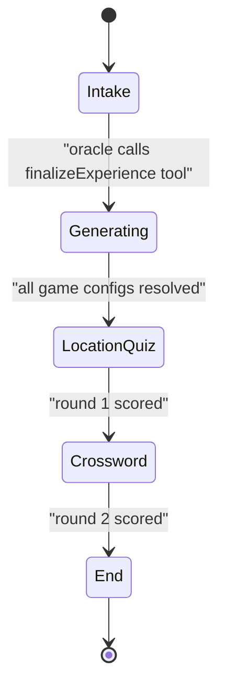
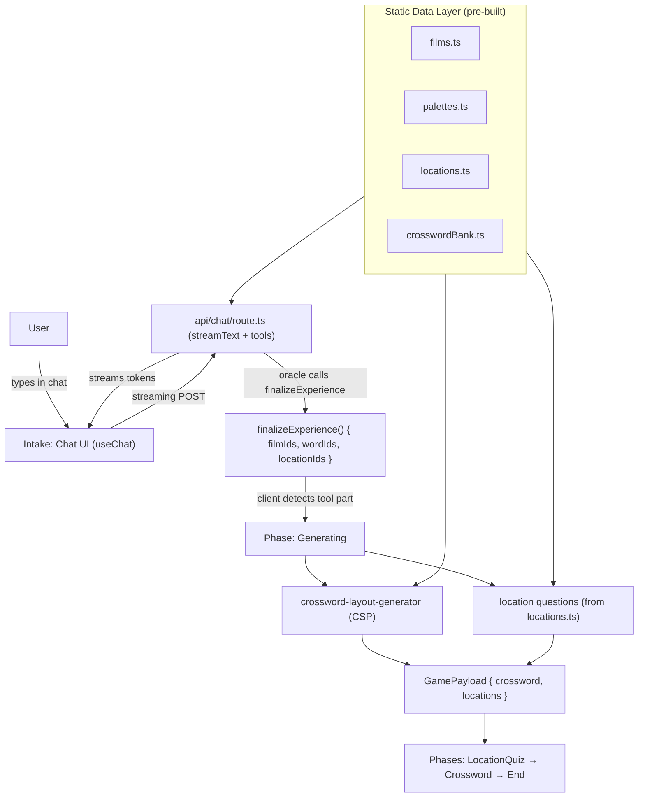

# A24 Puzzle — Architecture Decisions

> Archived plan that this project is being built from. The intake design evolved
> slightly during implementation: color palettes are woven into the conversation
> (via the oracle's `showPalette` tool) rather than being a standalone matching
> game, so the runtime phases are `intake → generating → locationQuiz → crossword → end`.

## Why This Decision Matters for Novelty

A questionnaire and a conversation both end at the same place (the model generating
game config), but they feel entirely different to a hiring manager who plays it:

- **Questionnaire path**: fills out cards → loading → games. Competent. Expected. Every Buzzfeed quiz since 2012.
- **Conversation path**: talks to a film oracle with a distinctive voice → the model decides when it knows enough → theatrical transition → games that explicitly reference what you said. Nobody else has built this.

The conversation path doesn't just feel different — it *is* the A24 brand. A24 is
not about having the right answers; it's about taste, specificity, and subjectivity.
A conversation where the oracle probes your film sensibility embodies that. A form does not.

**Recommendation: conversational intake.** The five decisions below flow from that choice.

---

## Decision 1: How the Oracle Knows It Has Enough Information

This is the most important technical decision. If the model must be told when to
stop, the experience becomes user-driven. If the model decides, the experience
becomes AI-driven — which is the novel part.

**Wrong approach**: user clicks a "Generate my puzzles" button after chatting. The model is just a fancier form.

**Right approach**: the model uses **tool calling** to signal completion. You define a tool:

```typescript
const finalizeExperience = tool({
  description: "Call when you have enough to generate a personalized experience",
  inputSchema: z.object({
    selectedFilmIds: z.array(z.string()),
    moods: z.array(z.string()),
    crosswordWordIds: z.array(z.string()),
    locationIds: z.array(z.string()),
  }),
});
```

When the model calls this tool, the client detects the tool part and transitions to
the loading screen. The model itself decides when to make the leap. The UX moment is:
the oracle says something like *"I think I see you now."* and then calls the tool.
Theatrical, not mechanical.

---

## Decision 2: Streaming Library

Use the **Vercel AI SDK**. It is purpose-built for exactly this pattern:

- `useChat` manages conversation history, streaming, and tool-call state automatically
- Tool parts (`tool-finalizeExperience`) surface in the message stream — that's where we transition phase
- Works natively with Next.js App Router via `streamText` in a Route Handler

**Route**: `src/app/api/chat/route.ts` — a streaming POST handler using `streamText`
with the tool definitions attached.

> Provider note: we use the official `@ai-sdk/openai` provider pointed at OpenRouter's
> OpenAI-compatible endpoint (`baseURL: https://openrouter.ai/api/v1`, model
> `moonshotai/kimi-k2.6`). This keeps us off a vendor-specific module — swapping
> providers later is just a baseURL/key/model change.

---

## Decision 3: App Phase State Machine

The app has distinct phases. This is not a routing problem — it's a state machine
problem. Keep everything on a single route (`/`); the current phase drives what's rendered.



- **Intake**: the conversation UI. Full-screen, A24-aesthetic chat.
- **Generating**: cinematic loading beat while the crossword layout + location questions are built.
- **LocationQuiz / Crossword**: the two scored mini-games.
- **End**: scoring + fan tier.

State lives in a single client orchestrator component (`Experience`). No URL routing
needed for a portfolio demo.

---

## Decision 4: The Static Data Layer (Required Regardless of Intake Method)

This is the unsexy prerequisite that must exist before any dynamic generation works.
The model selects *from* this data; it never hallucinates it.

```
src/data/
  films.ts          — A24 films: { id, title, year, director, genres }
  palettes.ts       — per film: { filmId, stillImageUrl, swatches }
  locations.ts      — per film: { filmId, address, lat, lng, hint, photoUrl }
  crosswordBank.ts  — per film: { id, word, clue, difficulty }
```

The catalog of valid IDs is injected into the system prompt so the oracle can only
ever reference real films, palettes, locations, and words.

Palette extraction (production): use `node-vibrant` on film stills to automate hex
extraction. One-time script, run locally. The prototype hand-picks representative swatches.

---

## Decision 5: Session Persistence (Now vs. Later)

Do users get a shareable URL for their personalized game? This forks the backend.

| | Ephemeral | Shareable |
|---|---|---|
| Storage | React state | Vercel KV / Upstash |
| URL | `/` always | `/play/[sessionId]` |
| Backend | None | KV write on generate, KV read on load |
| Portfolio value | Sufficient | Higher (shows infra thinking) |

**Recommendation for v1**: ephemeral. Ship the experience first.

---

## Full System Architecture



---

## Build Sequence

1. **Assemble static data layer** — films, palettes, locations, crossword bank.
2. **Wire AI SDK** — `api/chat/route.ts` with `streamText`, define `showPalette` + `finalizeExperience` tools.
3. **Build app phase state machine** — `Experience` orchestrator.
4. **Build the conversation UI** — chat intake with A24 aesthetic + palette cards.
5. **Build the generation layer** — crossword layout + location question assembly.
6. **Build the game UIs** — location quiz, crossword renderer.
7. **Score + fan tier** — tally results, render the end screen.

---

## One Open Question to Resolve

**Does the conversation reference what was said during the games themselves?** (e.g.,
crossword clues that reflect a specific movie the user named). If yes, pass the raw
conversation transcript through to the clue generator — a second model call *after*
the tool fires, using the transcript as context. High-novelty, adds a round-trip to
the generation phase. Worth deciding before finalizing the data schema.
