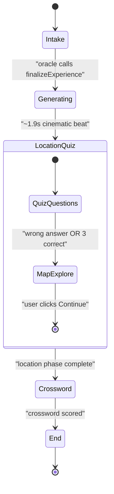
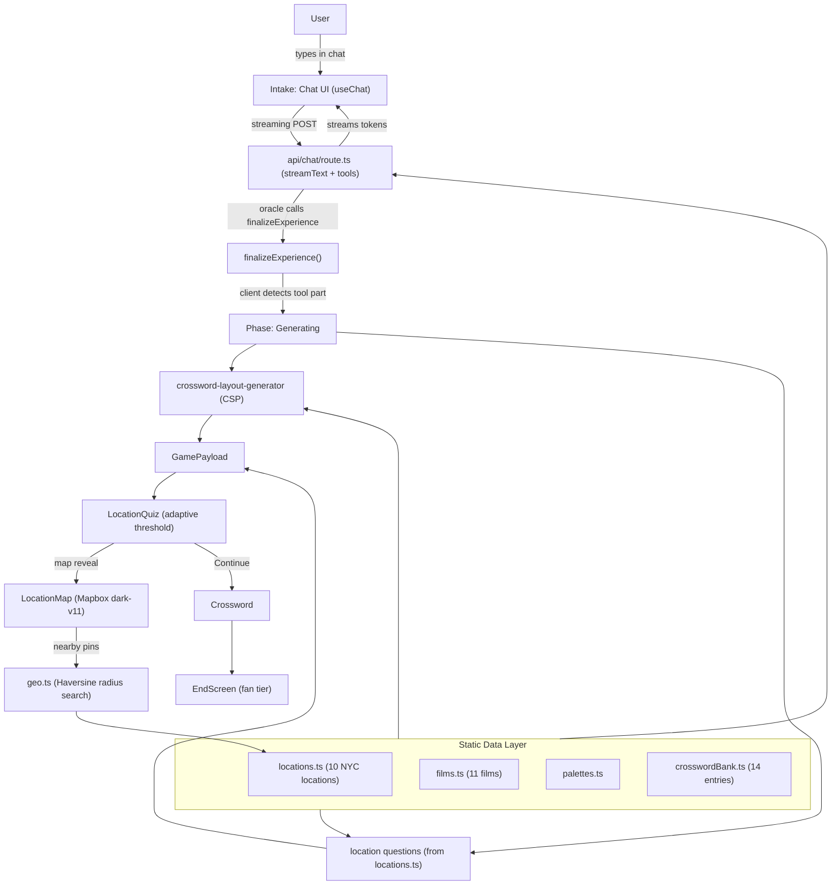

# A24 Puzzle — Architecture

> Living document. Last updated after the Mapbox location map integration
> (adaptive quiz threshold + explore surface with nearby pins).

## What This Is

A portfolio piece disguised as an interactive experience. A film oracle (LLM)
reads your cinematic sensibility through a short conversation, then builds you a
personalized "are you an A24 superfan?" game. The entire experience lives on a
single route (`/`) driven by a client-side phase state machine.

---

## Decision 1: Conversational Intake (Not a Questionnaire)

A questionnaire and a conversation both end at the same place (the model
generating game config), but they feel entirely different to a hiring manager:

- **Questionnaire path**: fills out cards → loading → games. Competent. Expected.
- **Conversation path**: talks to a film oracle with a distinctive voice → the
  model decides when it knows enough → theatrical transition → games that
  reference what you said. Nobody else has built this.

The conversation path *is* the A24 brand — taste, specificity, subjectivity.

---

## Decision 2: How the Oracle Knows It Has Enough

The model uses **tool calling** to signal completion. Two tools are defined in
`src/lib/oracle-tools.ts`:

- `showPalette` — called 2–3 times during the conversation to surface a film's
  color signature and gauge the user's reaction.
- `finalizeExperience` — called exactly once when the oracle has enough signal.
  Emits an `ExperienceProfile` with `selectedFilmIds`, `moods`,
  `crosswordWordIds`, and `locationIds`.

When the client detects `tool-finalizeExperience` in the message stream, it
transitions to the generating phase. The oracle says something like *"I think I
see you now,"* then calls the tool. Theatrical, not mechanical.

---

## Decision 3: Streaming Library

**Vercel AI SDK** (`ai`, `@ai-sdk/react`, `@ai-sdk/openai`).

- `useChat` manages conversation history, streaming, and tool-call state.
- Tool parts surface in the message stream for phase transitions.
- Works natively with Next.js App Router via `streamText` in a Route Handler.

**Route**: `src/app/api/chat/route.ts` — streaming POST handler.

**Provider**: `@ai-sdk/openai` pointed at OpenRouter's OpenAI-compatible
endpoint (`baseURL: https://openrouter.ai/api/v1`). Swapping providers is a
baseURL/key/model change.

---

## Decision 4: App Phase State Machine

Everything lives on `/`. The current phase drives what's rendered. State lives
in the `Experience` orchestrator component.



### Phases

| Phase | Component | Layout | What happens |
|---|---|---|---|
| `intake` | `OracleChat` | `copy` (narrow) | Full-screen A24-aesthetic chat with palette cards |
| `generating` | inline `Generating` | full | Cinematic loading beat: "I think I see you now." |
| `locationQuiz` | `LocationQuiz` + `LocationMap` | `game` (wide) | Adaptive quiz → Mapbox explore map (see below) |
| `crossword` | `Crossword` | `game` (wide) | Interactive crossword grid |
| `end` | `EndScreen` | `copy` (narrow) | Fan tier from combined scores |

### Location Phase: Two-Beat Design

The location phase has an adaptive threshold that rewards knowledge:

1. **Beat 1 — Quiz**: The player sees a film still, a hint, and 4 film options.
   Up to 3 questions are shown.
2. **Beat 2 — Explore Map**: A dark Mapbox map centered on the last answered
   location, with nearby A24 filming locations as hoverable pins.

**Transition rule**: wrong answer on any question triggers the map immediately.
Three correct answers triggers the map after the third. Everyone sees the map;
skilled players get more quiz time.

The explore map uses radius-based nearby pin filtering (`src/lib/geo.ts`) —
starts at 10 miles, expands in 10-mile increments until at least 1 nearby
location is found. Future-proofs for when the dataset grows beyond NYC.

---

## Decision 5: The Static Data Layer

The model selects *from* this data; it never hallucinates it. The catalog of
valid IDs is auto-injected into the system prompt via `src/lib/oracle-prompt.ts`.

```
src/data/
  films.ts          — { id, title, year, director, genres }
  palettes.ts       — { filmId, stillImageUrl, swatches[] }
  locations.ts      — { id, filmId, photoUrl, address, neighborhood, lat, lng, hint }
  crosswordBank.ts  — { id, filmId, word, clue, difficulty }
```

**Current catalog**: 11 films, 10 NYC filming locations across 3 films (Uncut
Gems, The Backrooms, Materialists), palettes for select films, 14 crossword entries.

---

## Decision 6: Session Persistence

| | Ephemeral (current) | Shareable (future) |
|---|---|---|
| Storage | React state | Vercel KV / Upstash |
| URL | `/` always | `/play/[sessionId]` |
| Backend | None | KV write on generate, KV read on load |

**Current**: ephemeral. Ship the experience first.

---

## Full System Architecture



---

## File Map

```
src/
├── app/
│   ├── api/chat/route.ts         — streaming oracle (OpenRouter + tools)
│   ├── layout.tsx                — Archivo font, metadata
│   ├── page.tsx                  — renders <Experience />
│   └── globals.css               — A24 shop tokens, Mapbox pin/popup styles
├── components/
│   ├── experience.tsx            — phase state machine orchestrator
│   ├── app-shell.tsx             — layout wrapper (copy / game / full widths)
│   ├── site-header.tsx           — minimal header
│   ├── debug-phase-bar.tsx       — dev-only phase jump buttons
│   ├── end-screen.tsx            — fan tier display
│   ├── intake/
│   │   ├── oracle-chat.tsx       — conversation UI (useChat)
│   │   └── palette-card.tsx      — color swatch cards shown during chat
│   └── games/
│       ├── location-quiz.tsx     — adaptive quiz + map reveal logic
│       ├── location-map.tsx      — Mapbox GL map (react-map-gl/mapbox)
│       └── crossword.tsx         — interactive crossword grid
├── data/
│   ├── films.ts                  — 11 A24 films
│   ├── palettes.ts               — color signatures per film
│   ├── locations.ts              — 10 NYC filming locations (3 films)
│   └── crosswordBank.ts          — 14 crossword entries
└── lib/
    ├── types.ts                  — all shared types and interfaces
    ├── game.ts                   — payload assembly (crossword layout + quiz questions)
    ├── geo.ts                    — Haversine distance + expanding-radius nearby search
    ├── scoring.ts                — fan tier calculation
    ├── oracle-prompt.ts          — system prompt builder (auto-injects data catalog)
    ├── oracle-tools.ts           — showPalette + finalizeExperience tool definitions
    ├── validate-experience.ts    — profile validation
    ├── chat-errors.ts            — error response formatting
    ├── debug-experience.ts       — dev-only fixtures and phase jumping
    ├── openrouter-dev-log.ts     — request logging for development
    └── utils.ts                  — cn() helper (tailwind-merge)
```

---

## Key Dependencies

| Package | Purpose |
|---|---|
| `next` 16.x | App Router, React 19, Turbopack |
| `ai` / `@ai-sdk/react` / `@ai-sdk/openai` | Streaming chat, tool calling |
| `mapbox-gl` / `react-map-gl` | Location explore map (dark-v11 style) |
| `crossword-layout-generator` | CSP-based crossword grid layout |
| `tailwindcss` 4.x / `shadcn` | Styling + UI primitives |

**Runtime**: Bun (not npm/pnpm). Dev server: `bun run dev`.

---

## Resolved Decisions

**Does the conversation reference what was said during the games?** Not in v1.
Crossword clues come from the static `crosswordBank`, not a second model call
using the transcript. This keeps the generation phase fast (no additional
round-trip) at the cost of less personalized clues. Worth revisiting if the
portfolio demo needs more "wow factor."
