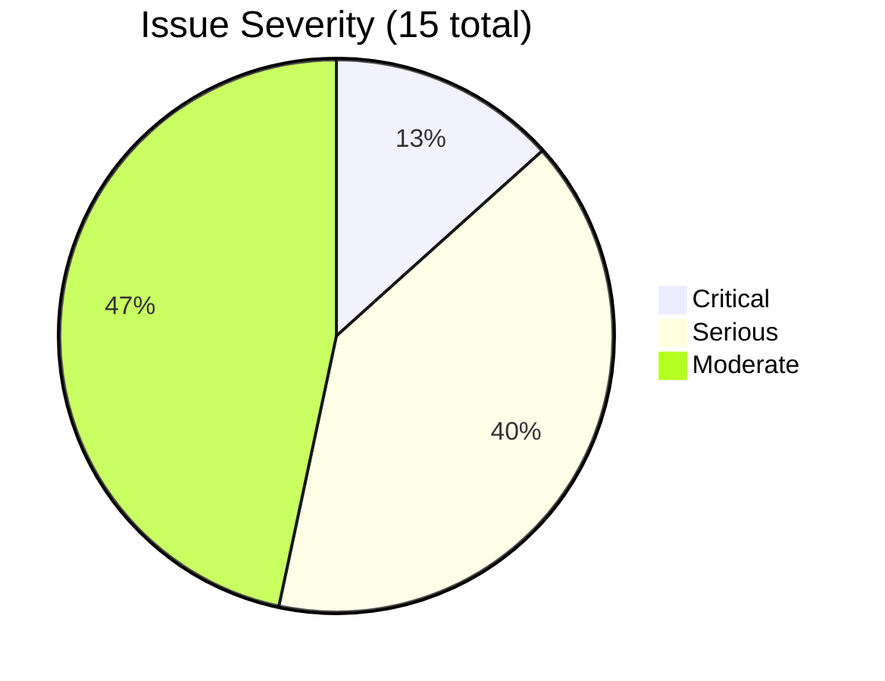
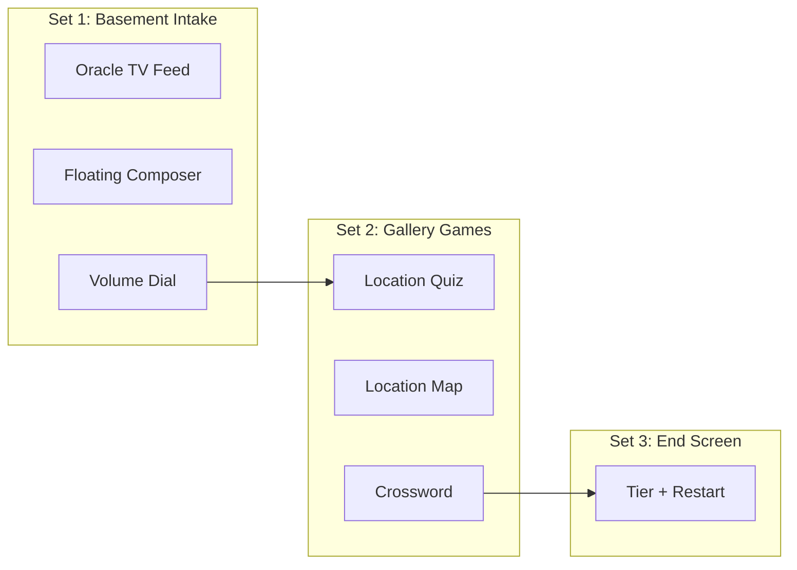
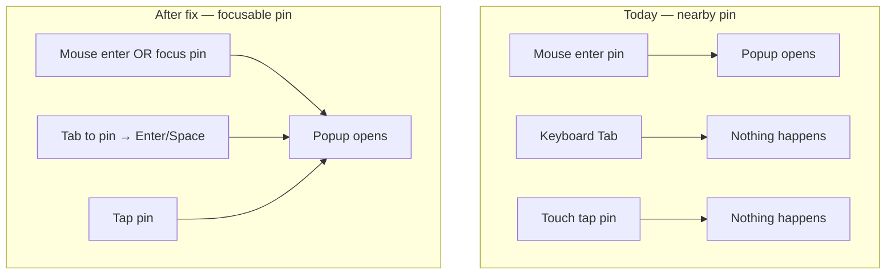
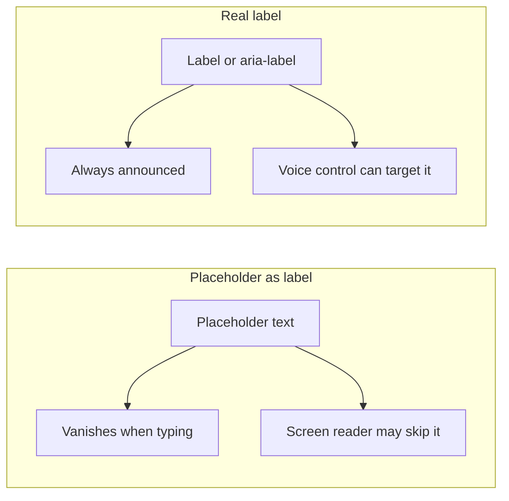
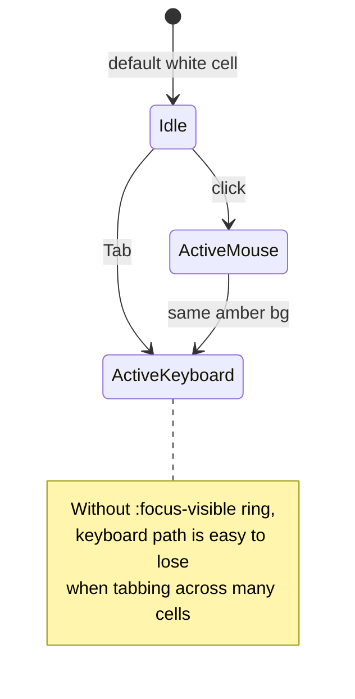
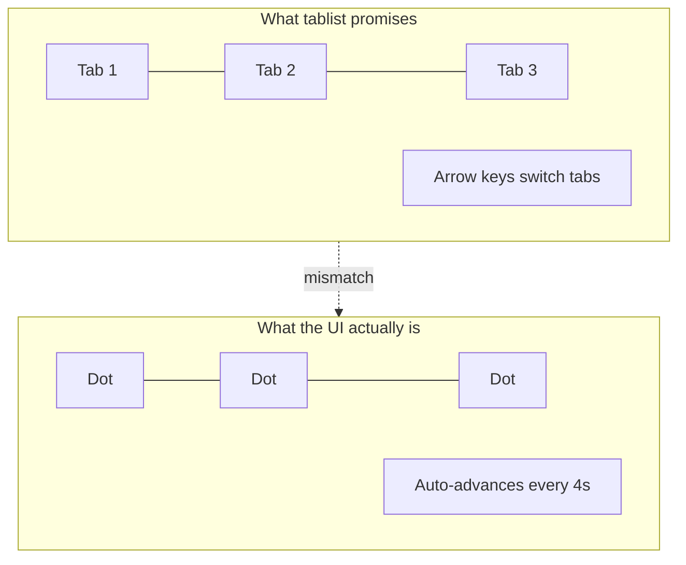
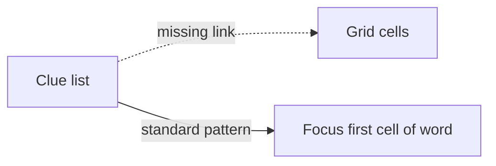
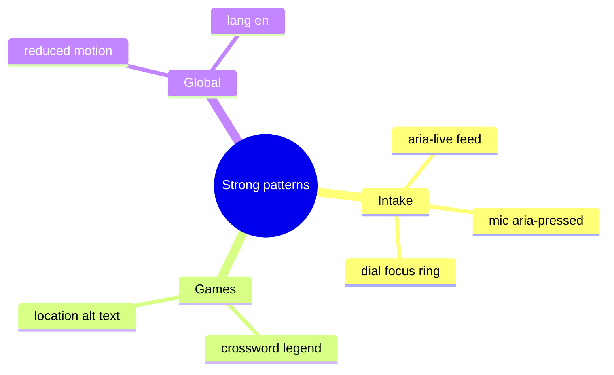
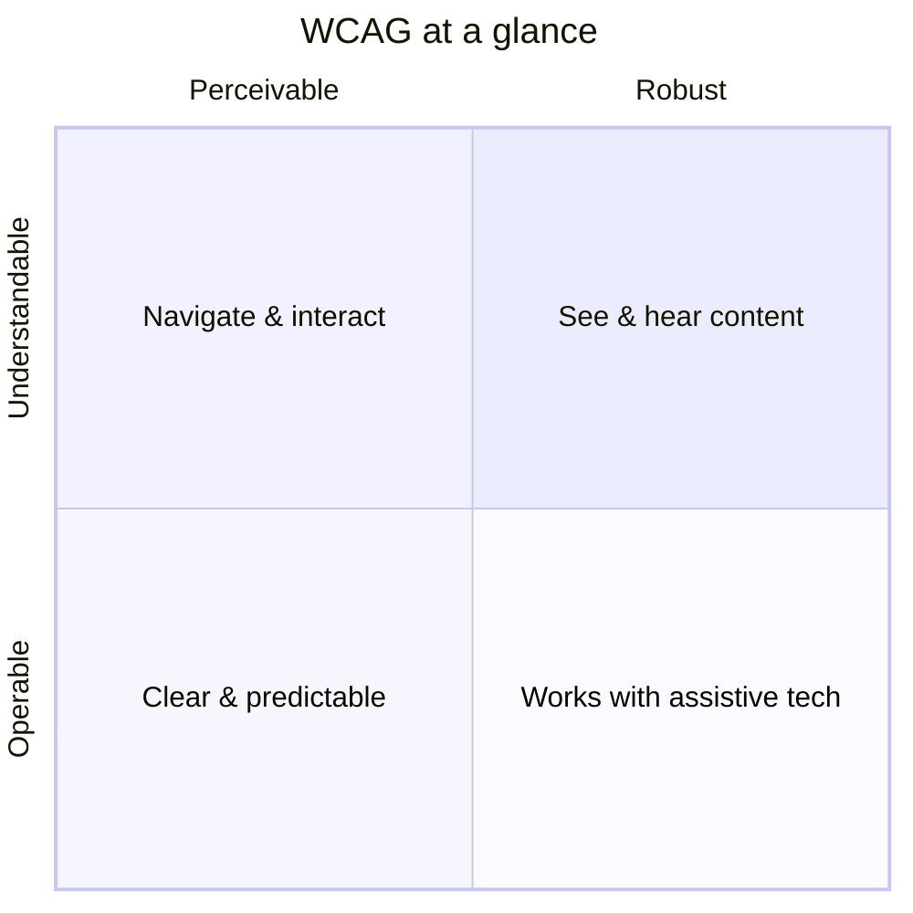

# Rams Accessibility & UX Review

> [!NOTE]
> **Audit date:** June 2026 · **Standard:** WCAG 2.1 Level AA (target) · **Score:** 72 / 100
>
> **Scope:** Primary experience surfaces — intake (`oracle-tv-scene`, `floating-composer`), games
> (`location-quiz`, `location-map`, `crossword`), shared chrome (`site-header`, `end-screen`,
> `a24-cta-button`).
>
> **Severity:** 2 critical · 6 serious · 7 moderate. Generated from the Rams design review
> command — re-run after fixes to refresh the score.

---

## How to Read This Document

> [!TIP]
> Each finding follows the same four beats:
>
> 1. **What we saw** — the code pattern in the repo today
> 2. **Who it affects** — real users and situations, not abstract compliance
> 3. **Why it matters** — the accessibility *and* UX case, with a diagram
> 4. **What good looks like** — a concrete fix direction

Think of accessibility like **mixing a film for every playback system**: the director's cut looks
great in the theater, but if the dialogue vanishes on laptop speakers, the story didn't reach the
audience. These fixes are about making sure the oracle experience reads clearly on *every*
channel — keyboard, screen reader, touch, and low vision.

---

## Score Breakdown

> [!IMPORTANT]
> **72 / 100** today. Fixing the composer label and map pin keyboard access alone would likely
> move the score into the **low 80s**. Global CTA focus and crossword polish could push toward
> **90+**.



| Tier | Count | Meaning |
|------|-------|---------|
| **Critical** | 2 | Blocks or severely degrades access for some users |
| **Serious** | 6 | Fails WCAG AA patterns; fix soon |
| **Moderate** | 7 | Polish and predictability; fix when touching the file |

---

## The Three Sets (Visual Architecture)

The app is three visual "sets" with different interaction models. The audit issues cluster where a
set looks interactive but only works for one input channel.



| Set | Primary input | Main risk in this audit |
|-----|---------------|-------------------------|
| Basement | Voice + keyboard + mouse | Unlabeled textarea, weak focus rings |
| Gallery | Mouse + keyboard | Map pins mouse-only; crossword focus |
| End | Mouse + keyboard | Heading hierarchy across phases |

---

## Critical Issues

> [!CAUTION]
> These two issues **block or severely degrade** access for keyboard, screen reader, and touch
> users. Fix before treating the map beat or intake composer as shippable.

### 1. Map pins are mouse-only

**File:** `src/components/games/location-map.tsx` (~165–169)

**What we saw:**

```tsx
<div
  className="nearby-pin"
  onMouseEnter={() => handleMarkerEnter(loc.id)}
  onMouseLeave={scheduleCollapsedClose}
/>
```

**Who it affects:**

- Keyboard-only users (motor disability, broken trackpad, power users who tab)
- Screen reader users who cannot "hover" to reveal popups
- Touch users on devices where hover is unreliable

**Why it matters — the signal chain:**

On a soundboard, every fader must be reachable from the same workflow. Here, nearby location pins
are wired to **hover only** — like a fader that only moves if you wave your hand over it but
ignores the knob.



> [!TIP]
> **UX upside:** Pin cards become discoverable. Users who don't instinctively hover map markers
> still get the film-location story — which is the whole point of the map beat.

**Fix direction:**

```tsx
<button
  type="button"
  className="nearby-pin"
  aria-label={`${getFilmTitle(loc.filmId)} — ${loc.neighborhood}`}
  aria-expanded={hoveredId === loc.id}
  onFocus={() => handleMarkerEnter(loc.id)}
  onBlur={scheduleCollapsedClose}
  onMouseEnter={() => handleMarkerEnter(loc.id)}
  onMouseLeave={scheduleCollapsedClose}
/>
```

---

### 2. Composer textarea has no accessible name

**File:** `src/components/intake/floating-composer.tsx` (~107–121)

**What we saw:**

```tsx
<textarea
  placeholder="Speak from the couch…"
  aria-describedby="oracle-tv-compose-status"
  ...
/>
```

**Who it affects:**

- Screen reader users hear "edit text, blank" with no field purpose
- Voice control users ("Click *Speak from the couch*") — placeholders are **not** reliable
  control names

**Why it matters — placeholder ≠ label:**



| Approach | Announced when empty? | Announced when filled? | Voice control |
|----------|----------------------|------------------------|---------------|
| Placeholder only | Sometimes | ❌ Often not | ❌ Unreliable |
| `<label>` or `aria-label` | ✅ | ✅ | ✅ |

> [!TIP]
> **UX upside:** The composer is the **hero control** of the intake set. Naming it clearly
> ("Message to the oracle") matches the narrative frame and reduces hesitation for first-time
> visitors.

**Fix direction:**

```tsx
<label htmlFor="oracle-message" className="sr-only">
  Message to the oracle
</label>
<textarea
  id="oracle-message"
  aria-describedby="oracle-tv-compose-status"
  ...
/>
```

---

## Serious Issues

> [!WARNING]
> Six patterns fail WCAG AA expectations for focus visibility, target size, or ARIA semantics.
> These won't block every user, but they create friction for keyboard, low-vision, and motor
> users across multiple beats in the experience.

### 3. Focus outline removed on composer textarea

**File:** `src/components/intake/floating-composer.tsx` (~120)

**What we saw:** `focus:outline-none` with no replacement ring in CSS.

**Why it matters:**

Keyboard users navigate by **focus position** — like a follow-spot on stage. Remove the spot
without adding another cue and they lose their place in a dark UI.

```
  Mouse user                    Keyboard user (today)
  ──────────                    ─────────────────────
  Clicks field                  Tabs to field
  Sees cursor blink      vs.    ??? (no ring, dark bg)
  Knows where they are          May not know focus landed
```

> [!NOTE]
> **WCAG 2.4.7 Focus Visible** — focus indicator must be visible.

**Fix direction:**

```
focus-visible:ring-2 focus-visible:ring-[#9dff9d]/50
focus-visible:ring-offset-2 focus-visible:ring-offset-[#120f0c]
```

---

### 4. Crossword cells: `outline-none` without focus-visible replacement

**File:** `src/components/games/crossword.tsx` (~544)

**What we saw:**

```tsx
const base = "... outline-none";
if (isActive) return `${base} bg-amber-300`;
```

Active state (amber fill) is tied to **click/focus** via React state — but there is no distinct
**focus-visible** style. A mouse click and a tab focus look the same as each other, and neither
shows a ring.



> [!TIP]
> **UX upside:** Crosswords are inherently keyboard-first. A visible focus ring preserves the
> "cursor position" metaphor solvers expect from NYT-style puzzles.

**Fix direction:** Keep amber for word highlight; add
`focus-visible:ring-2 focus-visible:ring-amber-600 focus-visible:z-10` on the input.

---

### 5. A24 CTA button: focus only animates the arrow

**Files:** `src/components/a24-cta-button.tsx`, `src/app/globals.css` (~284–286)

**What we saw:** `:focus-visible` shrinks the arrow wrap — the label does not gain a ring or
underline.

```
  Hover / Focus-visible (today)
  ─────────────────────────────
  [━━arrow━━] SEND     →    [━] SEND
       ↑ only this moves; button boundary unchanged
```

**Why it matters:** Low-vision and keyboard users may not notice a subtle width animation on a
decorative element. The **entire hit target** should read as focused.

**Fix direction:**

```css
.a24-cta-link:focus-visible {
  outline: 2px solid currentColor;
  outline-offset: 4px;
}
/* Keep arrow animation as enhancement, not the only cue */
```

> [!IMPORTANT]
> This CTA appears on intake send, location quiz next, map continue, crossword reveal, and end
> restart — fixing it once improves **five beats** in the experience.

---

### 6. Read-aloud clue button likely under 44×44px

**File:** `src/components/games/crossword.tsx` (~525–531)

**What we saw:** Icon-only button with `<Volume2 className="size-4" />` (~16px) and no min
dimensions.

> [!NOTE]
> **WCAG 2.5.5 Target Size** — interactive targets should be at least 44×44 CSS pixels where
> possible.

```
  Today          Recommended
  ─────          ───────────
  ┌──┐           ┌────────┐
  │🔊│  ~16px     │   🔊   │  44×44 min
  └──┘           └────────┘
  hard on        comfortable for
  touch + tremor fat finger + motor
```

> [!TIP]
> **UX upside:** The read-aloud control is optional help — making it easy to hit means more people
> will discover the oracle voice on clues.

---

### 7. Mic button is 40×40px (`size-10`)

**File:** `src/components/intake/floating-composer.tsx` (~131)

Same target-size story as the volume icon. The mic is a **primary** intake action (speak to the
oracle). It should meet or exceed the 44px guideline.

**Fix direction:** Change `size-10` → `size-11` (44px in Tailwind's default scale).

---

### 8. Carousel uses misleading `role="tablist"`

**File:** `src/components/games/location-pin-card.tsx` (~84–100)

**What we saw:**

```tsx
<div role="tablist" aria-label="Location photos">
  <span role="presentation" aria-hidden={i !== activeIndex} ... />
</div>
```

**Why it matters:** ARIA roles are a **contract** with assistive tech. `tablist` promises tabs you
can select with arrow keys. These dots are **progress indicators**, not controls.



**Fix direction (decorative dots):**

```tsx
<div aria-hidden="true" className="location-pin-card__carousel">
  {/* visual dots only */}
</div>
```

**Fix direction (if dots become interactive later):** Use real `role="tab"` buttons with
`aria-selected` and keyboard handlers.

---

## Moderate Issues

> [!NOTE]
> Seven polish items — predictable structure, clearer landmarks, and non-color feedback. Tackle
> when touching the relevant file; none are launch blockers on their own.

### 9. Generating phase not announced

**File:** `src/components/experience.tsx` (~188–196)

When phase flips from intake → generating, sighted users see copy; screen reader users may hear
silence until the next interactive region.

**Fix direction:** Wrap generating copy in `aria-live="polite"` or add a visually hidden status
region.

---

### 10. Crossword cell labels are coordinates, not puzzle context

**File:** `src/components/games/crossword.tsx` (~406)

`aria-label="Row 3, column 7"` is technically a name but not a **useful** one. Solvers think in
clue numbers and direction.

| Label type | Screen reader experience |
|------------|--------------------------|
| Row/col | "Row 3, column 7" — mental map required |
| Clue-aware | "12 Across, letter 3 of 8" — matches the puzzle |

---

### 11. Clue list items are not selectable

**File:** `src/components/games/crossword.tsx` (~507–537)

Active clue is styled (`bg-amber-100/80`) but only grid cells receive focus. Clicking a clue to jump
to that word is standard crossword UX and helps keyboard/screen reader users who navigate by clue
list.



---

### 12. Footer nav looks functional but items are inert

**File:** `src/components/site-footer.tsx` (~18–38)

`<nav aria-label="Shop">` with `<span>` children reads as navigation but nothing is linkable.
Screen reader users may try to activate items that go nowhere.

**Options:**

- Mark decorative footer `aria-hidden="true"` if it's pure visual parity with shop.a24
- Or use real `<a href="...">` for items that should work

---

### 13. Heading hierarchy skips `<h1>` on game phases

**Files:** `end-screen.tsx` (has `<h1>`), `location-quiz.tsx`, `crossword.tsx` (eyebrow `<p>` only)

Page outline for assistive tech:

```
Today                         Suggested
─────                         ─────────
intake:     (no h1)           h1: The A24 Oracle
location:   (no h1)           h1: Where Was This Shot
crossword:  (no h1)           h1: The A24 Crossword
end:        h1 tier title     h1: Your tier (keep)
```

One `<h1>` per phase gives users a **landmark** when the set changes.

---

### 14. Quiz feedback leans on color

**File:** `src/components/games/location-quiz.tsx` (~140–145)

Text backup exists ("Correct." / "It was …") — good. Adding a non-color cue (✓/✗ prefix or
icon)
helps color-blind users scan results faster.

```
  Color only              Color + icon
  ──────────              ──────────────
  [green tint] Correct    ✓ Correct
  [red tint]   Wrong       ✗ It was Minari
```

---

### 15. Dual design systems between intake and games

Intentional art direction — basement CRT vs gallery shop. The gap to watch is **interaction
tokens**: focus rings and error colors on intake (`#9dff9d`, `#ffb4a8`) don't carry into game
phases. Shared `:focus-visible` tokens would make the handoff feel like one product, not two apps
stitched together.

---

## What's Working Well

> [!TIP]
> These patterns are worth **preserving and copying** elsewhere — they show the team already
> knows how to do accessibility well in places. Use them as the template for the fixes above.

| Pattern | Where | Why it's good |
|---------|-------|---------------|
| `aria-label` on volume dial | `tv-volume-dial.tsx` | Icon-only control with clear name + `focus-visible` ring |
| `aria-pressed` + dynamic mic label | `floating-composer.tsx` | Toggle state is announced correctly |
| `aria-live="polite"` on oracle feed | `tv-oracle-feed.tsx` | New oracle lines reach screen readers without interrupting |
| `role="alert"` on chat errors | `floating-composer.tsx` | Errors interrupt appropriately |
| Crossword legend section | `crossword.tsx` | Documents keyboard model in-page |
| `prefers-reduced-motion` | `globals.css` | CRT, dial, mic animations respect user OS setting |
| Logo `alt="A24"` | `site-header.tsx` | Meaningful, concise image text |
| `lang="en"` on `<html>` | `layout.tsx` | Correct language for screen readers |



---

## Recommended Fix Priority

> [!IMPORTANT]
> Tackle **top-left first** — highest impact for the least effort. Items 1–3 are quick wins that
> touch the most users.

Impact vs. effort — tackle top-left first:

```
  High impact
      │
      │  ① Composer label + focus
      │  ② Map pin keyboard
      │  ③ CTA focus ring (global)
      │
      │  ④ Crossword focus + clues
      │  ⑤ Touch target sizes
      │
      │  ⑥ Carousel ARIA cleanup
      │  ⑦ Heading h1 per phase
      └──────────────────────────► Low effort
         quick            moderate
```

| Priority | Item | Files | Est. effort |
|----------|------|-------|-------------|
| 1 | Composer label + focus ring | `floating-composer.tsx` | ~10 min |
| 2 | Keyboard-accessible map pins | `location-map.tsx` | ~20 min |
| 3 | CTA `:focus-visible` ring | `globals.css`, `a24-cta-button.tsx` | ~10 min |
| 4 | Crossword focus + clue labels | `crossword.tsx` | ~30 min |
| 5 | Touch targets (mic, volume) | `floating-composer.tsx`, `crossword.tsx` | ~10 min |
| 6 | Carousel role cleanup | `location-pin-card.tsx` | ~5 min |
| 7 | Phase headings + live regions | `experience.tsx`, game headers | ~20 min |

---

## WCAG Quick Reference (Findings → Criteria)

| Finding | WCAG | Principle |
|---------|------|-----------|
| Map pins mouse-only | 2.1.1 Keyboard | Operable |
| Textarea no label | 1.3.1 Info and Relationships | Perceivable |
| Focus outline removed | 2.4.7 Focus Visible | Operable |
| Touch targets < 44px | 2.5.5 Target Size | Operable |
| Misleading tablist | 4.1.2 Name, Role, Value | Robust |
| Generating not announced | 4.1.3 Status Messages | Robust |
| Color-only feedback | 1.4.1 Use of Color | Perceivable |
| Heading hierarchy | 1.3.1 Info and Relationships | Perceivable |

The four WCAG principles in plain language:



---

## Director's Commentary

Accessibility work is not a separate "compliance pass" bolted onto the end of production — it's
**continuity**. The same prop (a button, a pin, a textarea) must behave consistently whether the
user is on a phone, a keyboard, or a screen reader.

> [!IMPORTANT]
> The highest-leverage fixes in this audit are small and localized:
>
> 1. **Name things** — labels and `aria-label` on primary controls
> 2. **Show focus** — never `outline-none` without a designed replacement
> 3. **One input, many channels** — if hover opens it, focus and tap should too

---

## Related Files

| File | Role in audit |
|------|----------------|
| `src/components/intake/floating-composer.tsx` | Label, focus, mic target size |
| `src/components/games/location-map.tsx` | Keyboard-accessible pins |
| `src/components/games/crossword.tsx` | Focus, clue labels, read button size |
| `src/components/a24-cta-button.tsx` | Shared CTA focus |
| `src/app/globals.css` | `.a24-cta-link` focus styles |
| `src/components/games/location-pin-card.tsx` | Carousel ARIA |
| `src/components/experience.tsx` | Generating live region |
| `src/components/site-footer.tsx` | Decorative nav semantics |
| `src/components/end-screen.tsx` | Heading landmark (reference) |
