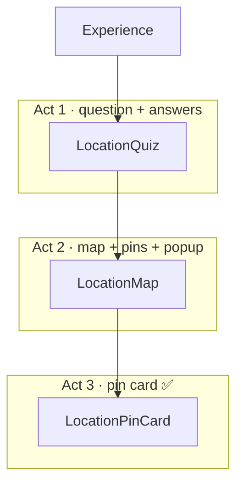

# Location Phase — Module Readability Refactor

> [!NOTE]
> **Audit date:** June 2026 · **Scope:** Location phase components and lib support
>
> **Related:** [readability-patterns-tutorial.md](../readability-patterns-tutorial.md) ·
> [rams-accessibility-ux-review.md](./rams-accessibility-ux-review.md) ·
> [vercel-composition-patterns.md](./vercel-composition-patterns.md) ·
> [FOR_ETHAN.md](../FOR_ETHAN.md)

---

## How to Read This Document

> [!TIP]
> Each module section follows the same four beats:
>
> 1. **Problem today** — what makes the file hard to scan
> 2. **Suggested story order** — bottom-up file layout (config → leaves → root → export)
> 3. **Why it helps** — the readability payoff
> 4. **Film analogy** — where it clarifies the pattern (optional)

The location phase is a **three-act set** — quiz question → map explore → continue. Act 3's popup
card (`location-pin-card.tsx`) is already story-ordered. This audit ranks the other modules that
deserve the same treatment.

Think of module file order like **a call sheet organized by department**: read the props crew
before the director block that assembles them. Bottom-up order matches dependency — leaves first,
root last.

---

## Component Tree (What Talks to What)

Short labels in the diagram; full beat names in the table below (avoids clipped boxes in
Obsidian / narrow preview panes).



| Act | Component | File |
| --- | --------- | ---- |
| 1 | `LocationQuiz` | `src/components/games/location-quiz.tsx` |
| 2 | `LocationMap` | `src/components/games/location-map.tsx` |
| 3 | `LocationPinCard` | `src/components/games/location-pin-card.tsx` ✅ story-ordered |

**Lib support** (already fine as-is):

| Module                         | Job                  |
| ------------------------------ | -------------------- |
| `lib/geo.ts`                   | Nearby pin search    |
| `lib/location-card-metrics.ts` | Popup placement math |
| `data/locations.ts`            | Location catalog     |

---

## Priority Ranking

| Priority | Module                         | Current shape                                   | Benefit                                              |
| -------- | ------------------------------ | ----------------------------------------------- | ---------------------------------------------------- |
| **1**    | `location-map.tsx`             | One ~200-line export, all logic inside          | **High** — hardest to read; Rams pin work lands here |
| **2**    | `location-quiz.tsx`            | Export = root; `cardClass` at bottom; UI inline | **Medium–high** — clear beats to extract             |
| **3**    | `location-pin-card.tsx`        | Story order done                                | **Done** — use as template                           |
| **4**    | `lib/location-card-metrics.ts` | Constants → private helper → exports            | **Low** — already correct for a pure lib             |
| **5**    | `lib/geo.ts`                   | Private `haversine` → export                    | **Low** — small, already bottom-up                   |

Skip for this pattern: `experience.tsx` (one line of phase wiring), `data/locations.ts` (data),
`globals.css` (styles).

---

## 1. `location-map.tsx` — Biggest Win

**File:** `src/components/games/location-map.tsx`

**Problem today:** One component owns Mapbox, hover timers, popup placement, markers, and continue
CTA. Reading top-to-bottom is reading **implementation**, not **composition**.

**Suggested story order:**

```tsx
// ── Config ──
MAPBOX_TOKEN, HOVER_BRIDGE_MS

// ── Types ──
LocationMapProps

// ── Leaf: hero pin (visual only) ──
function HeroPin() { return <div className="hero-pin" />; }

// ── Leaf: nearby pin (interactive — Rams fix lives here) ──
function NearbyMapPin({ location, onEnter, onLeave }: ...) { ... }

// ── Leaf: popup shell (hit area + LocationPinCard) ──
function LocationMapPopup({ location, expanded, onMoreInfo, onEnter, onLeave }: ...) { ... }

// ── Root: state + Map composition ──
function LocationMapRoot({ heroLocation, nearbyLocations, onContinue }: ...) {
  // hoveredId, expandedId, timers, updatePopupPlacement
  return ( <Map>...</Map> );
}

// ── Public export ──
export function LocationMap(props) {
  return <LocationMapRoot {...props} />;
}
```

**Why it helps:** Hover-bridge logic and pin markup stop fighting for attention. When you fix
keyboard-accessible pins (Rams), you edit `NearbyMapPin` — one file region, one job.

**Film analogy:** Right now the map file is **director + camera + props + talent in one person**.
Splitting leaves is assigning departments.

---

## 2. `location-quiz.tsx` — Medium Win, Good Learning File

**File:** `src/components/games/location-quiz.tsx`

**Problem today:**

- Exported `LocationQuiz` **is** the root (no wrapper — fine for now)
- `cardClass` helper sits **after** the component (readers hit JSX before the styling rules)
- Question UI, feedback row, and map reveal are one block

**Suggested story order:**

```tsx
// ── Config ──
MAP_THRESHOLD

// ── Types ──
LocationQuizProps

// ── Pure helpers ──
function answerButtonClass(answered, isCorrect, isPicked): string { ... }
function shouldRevealMap(answered, wasCorrect, index): boolean { ... }

// ── Leaf: question header ──
function LocationQuizHeader({ round, total }: ...) { ... }

// ── Leaf: still + hint ──
function LocationQuizStill({ location }: ...) { ... }

// ── Leaf: answer grid ──
function LocationQuizOptions({ options, picked, onPick, answered, correctId }: ...) { ... }

// ── Leaf: feedback + optional Next ──
function LocationQuizFeedback({ ... }: ...) { ... }

// ── Root: index state, pick/next, compose + LocationMap reveal ──
export function LocationQuiz({ questions, onComplete }: ...) { ... }
```

**Why it helps:** Each **beat** of Round 1 becomes a named unit — still, choices, feedback, map
handoff. Props wiring (`onPick`, `answered`) repeats the lesson from `PinCardSlideDots`.

**Optional:** extract `pick` / `next` into a tiny `useLocationQuizRound` hook if state grows; not
required yet.

---

## 3. Already in Good Shape (Use as Contrast)

**`lib/location-card-metrics.ts`** — textbook pure module:

```
LOCATION_CARD constants
private verticalOverflow()
exports: getLocationCardPopupPlacement, getLocationCardHeight
```

**`lib/geo.ts`** — private `haversine`, one public `getNearbyLocations`. No React, no reorder
needed.

When a file has **no JSX and no state**, story order = **constants → private helpers → exports**.
These already match.

---

## Suggested Refactor Order

If you do this incrementally:

```
1. location-map.tsx     ← extract NearbyMapPin + popup leaf (unblocks Rams pin fix)
2. location-quiz.tsx    ← move cardClass up; extract Options + Feedback leaves
3. (optional) hook      ← useLocationQuizRound if quiz root still feels long
```

Don't refactor `location-pin-card.tsx` again — it's the **reference implementation** for the other
two.

---

## How to Know a File "Needs" Story Order

Ask:

1. **Can I describe it in beats without scrolling?** (`LocationQuiz`: header → still → pick →
   feedback → map)
2. **Is the export also the only component?** (often a sign everything got poured into one bowl)
3. **Are helpers below the JSX?** (`cardClass` after `LocationQuiz` — reader sees usage before
   definition)
4. **Will the next feature touch one visual piece?** (keyboard pins → only `NearbyMapPin` should
   change)

If yes to 2–4, story order pays off. If the file is under 80 lines and one idea (`geo.ts`), leave
it.

---

> [!IMPORTANT]
> **`location-map.tsx` first**, then **`location-quiz.tsx`**. Lib files and `location-pin-card.tsx`
> are fine. The map module is where parent/child, hover state, and Rams accessibility will collide
> — splitting it makes that work readable instead of scary.

---

_Patterns align with the module file order guidance in
[FOR_ETHAN.md](../FOR_ETHAN.md) and the readability field guide in
[readability-patterns-tutorial.md](../readability-patterns-tutorial.md)._
