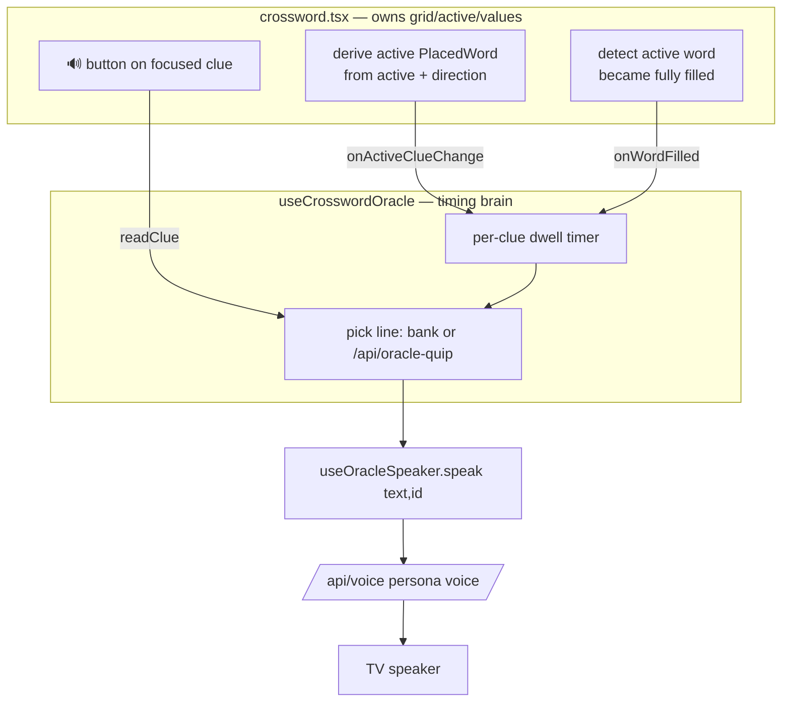

# Crossword Oracle — Voice Hints + Idle Teasing Plan

> [!NOTE]
> Living document. Saved June 2026.
>
> Related: [valence-oracle-plan.md](./valence-oracle-plan.md) ·
> [scribe-realtime-stt-plan.md](./scribe-realtime-stt-plan.md) ·
> [remaining-features-plan.md](./remaining-features-plan.md) · [FOR_ETHAN.md](./FOR_ETHAN.md)

## Short answer

Carry the **persona you picked at intake** into the crossword phase as a voice. It reads the first
clue to set the tone, reads any clue on demand (🔊), and — if you sit on one clue too long —
teases you in character. When you finish filling a word, it reacts with a deliberately **ambiguous**
line that does *not* reveal whether you're right.

Think of it as the difference between a **scorekeeper** and a **host**. A scorekeeper (green cells,
locked input) tells you the answer is right and ends the tension. A host keeps the room alive
without spoiling the game — reacting to your *moves*, never confirming your *results*.

---

## Locked design decisions

| #   | Decision            | Choice                                                                                                                                         |
| --- | ------------------- | ---------------------------------------------------------------------------------------------------------------------------------------------- |
| 1   | Architecture        | **Approach A** — dedicated quip engine + shared speaker + lightweight quip endpoint. Built in **2 slices**.                                    |
| 2   | Quip source         | **Hybrid** — idle 20s → authored bank (instant); idle 45s → LLM clue-specific zinger.                                                          |
| 3   | Clue reading        | **Auto-read the first clue** on entering the crossword, then **on-demand (🔊) + idle quips**.                                                  |
| 4   | Idle model          | **Per-clue dwell** — timer tied to the focused clue; resets on clue change or when the active word becomes filled.                             |
| 5   | Completion feedback | **Pure ambiguity** — finishing a word fires one cryptic line from a shared pool, regardless of correctness. **No green cells, no input lock.** |

---

## The non-telegraphing principle (read this first)

The whole point of routing feedback through the Oracle's *voice* instead of the *grid* is to
**preserve the intersecting-word challenge.** The moment the user knows a word is correct — via a
green cell, a locked input, or a reaction that reliably maps to "right" — every crossing letter
becomes free, and the puzzle collapses.

Two rules fall out of this, and they are **load-bearing**:

1. **Completion reactions leak nothing.** The same cryptic pool (`"Hmmmm."`, `"Noted."`, `"The cards
stir."`, `"…are you sure?"`) fires on *any* completed word, right or wrong. The engine does
**not** compute correctness for these reactions. A reaction means only "you finished a word."
2. **The dwell timer resets on *filled*, not on *correct*.** If idle-teasing continued on a
completed-but-wrong word, the continued teasing would itself signal "this is wrong." So the timer
resets when the active word becomes fully filled — regardless of correctness. (This is also the
right behavior: a user who filled a word isn't "stuck" on it.)

> [!WARNING]
> Any future change that makes a reaction, a highlight, or a timer behave *differently for
> correct vs. incorrect* re-opens the information leak. Treat correctness as something the engine
> deliberately refuses to act on until the final `check()`.

---

## Current architecture this builds on (verified)

| Existing piece      | File                                                                          | What it gives us                                                                                                                                                                                                                                                                                                                     |
| ------------------- | ----------------------------------------------------------------------------- | ------------------------------------------------------------------------------------------------------------------------------------------------------------------------------------------------------------------------------------------------------------------------------------------------------------------------------------ |
| Phase state machine | `[src/components/experience.tsx](../src/components/experience.tsx)`           | `phase === "crossword"` renders the puzzle (~line 165). Persona was chosen during `intake`.                                                                                                                                                                                                                                          |
| Selected persona    | `[src/lib/oracle-chat-persona.ts](../src/lib/oracle-chat-persona.ts)`         | `getActiveOraclePersonaId()` — module-level, readable from any phase.                                                                                                                                                                                                                                                                |
| The "mouth"         | `[src/hooks/use-oracle-voice.ts](../src/hooks/use-oracle-voice.ts)`           | `speak(text, id, vocalEmotion?)` + `cancelSpeech()`; a `generation` ref guard prevents overlapping audio; handles browser audio-unlock. **Currently coupled to chat `messages`/`status`.**                                                                                                                                           |
| Voice settings      | `[src/lib/oracle-voice-settings.ts](../src/lib/oracle-voice-settings.ts)`     | `resolveOracleVoiceSettings(personaId, vocalEmotion?)`; `PERSONA_BASELINES`.                                                                                                                                                                                                                                                         |
| TTS endpoint        | `[src/app/api/voice/route.ts](../src/app/api/voice/route.ts)`                 | Persona voice → MP3 → TV speaker.                                                                                                                                                                                                                                                                                                    |
| The crossword       | `[src/components/games/crossword.tsx](../src/components/games/crossword.tsx)` | Owns `active` cell, `direction`, `values`. An `activeWordCells` memo already finds the focused `PlacedWord` (with `.clue`, `.answer`, `.position`, `.orientation`, `.id`). Correctness is computed **only** in `check()` on the "Reveal my tier" button. No per-cell lock exists except `disabled={result !== null}` at end-of-game. |

**Key seam:** the crossword *owns the state the engine reads* (active clue, fill events) but should
**not own the quip logic**. `crossword.tsx` is already ~450 lines doing grid/input/scoring; bolting
timers + persona lines + TTS into it would tangle four jobs. The crossword **emits events**; a
dedicated hook **decides when the Oracle speaks**.

---

## Components & responsibilities

| Unit                                               | Job                                                                                                                                                                                                                                 | Slice |
| -------------------------------------------------- | ----------------------------------------------------------------------------------------------------------------------------------------------------------------------------------------------------------------------------------- | ----- |
| `useOracleSpeaker` (extract from `useOracleVoice`) | The shared **mouth**: fetch `/api/voice`, play through the TV speaker, own the `generation` guard so lines never overlap, handle audio-unlock. `useOracleVoice` is refactored to build on it (keeps its message-watching behavior). | 1     |
| `useCrosswordOracle`                               | The **brain**: owns the per-clue dwell timer, completion reactions, escalation, and cooldowns. Reads active clue + fill events; decides when/what to speak. Pure timing logic — no audio internals.                                 | 1     |
| `crossword-oracle-quips.ts`                        | Authored **bank** per persona (Marion / William / Lucy): clue-read flourishes, idle nudges, and the ambiguous completion pool. Includes a no-repeat-back-to-back picker.                                                            | 1     |
| `crossword.tsx` (edits)                            | Emit `onActiveClueChange(clue ǀ null)` and `onWordFilled(clue)`; add a 🔊 affordance on the focused clue; highlight the active clue in the clue list. **No** green/lock telegraphing.                                               | 1     |
| `POST /api/oracle-quip`                            | One-shot LLM **zinger**: `{ personaId, clue }` → `{ line }`. Tiny persona-flavored prompt, ~20-token cap, **no tools**. Fail-open → authored bank.                                                                                  | 2     |

---

## Data flow



Persona = `getActiveOraclePersonaId()`. Voice settings = that persona's **baseline** from
`oracle-voice-settings.ts` (neutral — there is **no mic** in the crossword phase, so no Valence
emotion input here).

---

## The four speech triggers + guards

| Trigger                  | When                                                                     | Source                                           | Slice |
| ------------------------ | ------------------------------------------------------------------------ | ------------------------------------------------ | ----- |
| **Auto-read first clue** | On crossword mount                                                       | Bank (`clueRead` + flourish)                     | 1     |
| **On-demand 🔊**         | User taps the speaker icon on the focused clue                           | Bank (`clueRead`)                                | 1     |
| **Per-clue dwell**       | 20s on same clue → idle nudge; still there at 45s → clue-specific zinger | 20s = bank; 45s = LLM (bank fallback in Slice 1) | 1 / 2 |
| **Completion reaction**  | Active word becomes fully filled (right OR wrong)                        | Bank (`completed`, ambiguous pool)               | 1     |

**Timer resets:** active clue changes, **or** active word becomes filled.

**Guards (playful, not nagging):**

- Never stack audio — reuse the `generation` guard in the speaker.
- Global cooldown (~12s) after any spoken line before another **idle** quip may fire.
- One dwell-escalation cycle per clue — don't loop the same clue forever.
- Completion reaction fires **once per fill event**.
- Everything yields to "the Oracle is already speaking."

> [!TIP]
> The ~12s cooldown and one-escalation-per-clue ceiling are tuning knobs — tweak to taste during
> Slice 1 manual testing.

---

## Authored bank shape

```ts
// crossword-oracle-quips.ts — voiced in each persona's register
// (Marion warmer, Lucy cooler, William cryptic). The `completed` pool is
// ambiguous BY DESIGN — same lines for correct and incorrect words.
type PersonaQuips = {
  clueRead: string[];   // "The cards reveal: {clue}"
  idle20: string[];     // gentle nudge — "The cards grow impatient."
  idle45: string[];     // generic fallback when /api/oracle-quip is unavailable
  completed: string[];  // ambiguous — "Hmmmm." / "Noted." / "…are you sure?"
};

const QUIPS: Record<OraclePersonaId, PersonaQuips> = { /* ladybird_mom, witch, materialist */ };

// No-repeat-back-to-back picker: never returns the same line twice in a row.
function pickQuip(pool: string[], lastSpoken?: string): string { /* ... */ }
```

---

## `POST /api/oracle-quip` (Slice 2)

- **Body:** `{ personaId: OraclePersonaId, clue: string, position?: number, orientation?: "across" |
"down" }`
- **Returns:** `{ line: string }`
- **Implementation:** OpenRouter (same provider as `/api/chat`) with a **tiny** persona-flavored
system prompt — *"You are {persona}. The user has stalled on this clue. Tease them into action in
one short sentence, in character. Do NOT reveal the answer."* — `max_tokens ≈ 24`, **no tools**,
**no message history**.
- **Why a new route, not `/api/chat`:** the chat route carries the tool pipeline (`showPalette`,
`finalizeExperience`) and full history. Reusing it risks a tool call mid-puzzle and adds
latency/cost. A one-shot route stays cheap and predictable.
- **Fail-open:** any error → the engine falls back to the `idle45` authored pool. The LLM tier is
an enhancement, never a dependency.

---

## Crossword.tsx integration (minimal, additive)

Add optional props so the component stays usable without the Oracle:

```ts
interface CrosswordProps {
  // ...existing...
  onActiveClueChange?: (clue: PlacedWord | null) => void;
  onWordFilled?: (clue: PlacedWord) => void; // fires when active word transitions to fully filled
}
```

- **Active clue:** derive the focused `PlacedWord` from the existing `activeWordCells` logic; call
`onActiveClueChange` when it changes.
- **Filled detection:** after each value change, check whether every cell of the active word is
non-empty; fire `onWordFilled` on the transition from "not all filled" → "all filled". Dedupe so
re-entering an already-filled word doesn't refire unless its contents changed. **Do not** compare
against solutions here.
- **🔊 affordance + active-clue highlight:** mark the focused clue in `ClueList` and give it a
speaker button that calls back into the engine's `readClue`.
- **Do NOT** add per-word green styling or per-cell `disabled` on completion. End-of-game
`disabled={result !== null}` stays as-is.

---

## Error handling

Fail-open everywhere. No audio unlock, `/api/voice` error, or `/api/oracle-quip` error → fall back
silently or to the authored bank. The crossword is fully playable with the Oracle mute; the feature
is enhancement, not a dependency.

---

## Testing

- **Unit (the timing brain):** fake timers — dwell escalation (20s → 45s), cooldown,
reset-on-fill, reset-on-clue-change, one-escalation-per-clue ceiling. Pure logic, no audio.
- **Bank:** no-repeat-back-to-back picker.
- `**/api/oracle-quip`:** fail-open returns the bank fallback shape.
- **Manual:** lines play in the **selected persona's** voice; nothing in the UI or audio reveals
correctness; auto-read fires once on entry; 🔊 reads the focused clue.

---

## Build order

**Slice 1 — working feature (no LLM):** ✅

1. Extract `useOracleSpeaker` from `useOracleVoice`; refactor `useOracleVoice` to consume it. Verify
intake voice still works unchanged.
2. `crossword-oracle-quips.ts` + no-repeat picker.
3. `crossword.tsx`: emit `onActiveClueChange` + `onWordFilled`; add 🔊 + active-clue highlight;
**no telegraphing**.
4. `useCrosswordOracle`: dwell timer, completion reaction, cooldowns, auto-read on mount. Wire into
the crossword render in `experience.tsx`.
5. Unit-test the timing brain; manual audio check.

**Slice 2 — the clever layer:** ✅

6. `POST /api/oracle-quip` (one-shot LLM, no tools, fail-open).
7. `useCrosswordOracle`: 45s escalation calls `/api/oracle-quip`, falls back to `idle45` bank on
error.
8. Update `[docs/FOR_ETHAN.md](./FOR_ETHAN.md)` with the "crossword host" beat.

**Post-slice hardening:** ✅

- Unit tests for `pickQuip`, dwell timing, and `/api/oracle-quip` fail-open fallback
(`crossword-oracle-quip-fetch.test.ts`).
- Crossword auto-read waits for browser audio unlock (same pattern as intake).
- Kimi K2.6: `reasoning.effort: none` on `/api/oracle-quip` so tokens become spoken text.

---

## Guardrails for the implementing agent

1. **Never telegraph correctness.** No green cells, no per-cell/per-word input lock, no reaction or
timer that behaves differently for correct vs. incorrect words. Correctness is acted on *only* in
the existing `check()` flow.
2. **The crossword must stay playable with the Oracle fully mute** — fail-open on every audio/LLM
path.
3. **Don't bloat `crossword.tsx`** — it emits events; the engine decides. Quip logic lives in
`useCrosswordOracle`, not the component.
4. **Reuse the voice, don't fork it** — both intake and crossword speak through the shared
`useOracleSpeaker`; no second `/api/voice` caller.
5. **No mic in the crossword phase** — voice output only; persona baseline voice settings
(neutral), no Valence input.
6. This is a **bun** project; consult `node_modules/next/dist/docs/` before touching routes.
