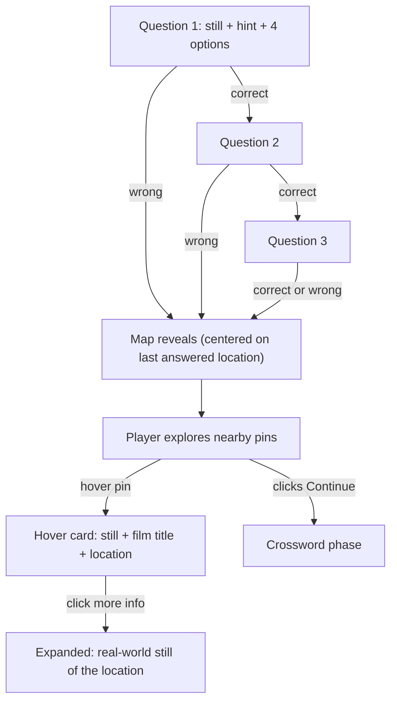

# Mapbox Location Map — Feature Plan

> Completed. All steps implemented. This document preserves the design
> decisions and implementation details for reference.

## Current State

The `locationQuiz` phase ([`src/components/games/location-quiz.tsx`](src/components/games/location-quiz.tsx)) is a straightforward image-and-multiple-choice quiz. No map is rendered. `mapbox-gl` and `react-map-gl` are installed but unused. The Mapbox token is already in `.env.local` but not referenced by any code.

The location data ([`src/data/locations.ts`](src/data/locations.ts)) carries `lat`/`lng` for 7 NYC points across 2 films. We will expand to **10 locations across 3 films** by adding Materialists before building the map.

## Design

The location phase has two beats. **Beat 1** is the quiz: the player sees a film still, a hint, and four film options. **Beat 2** is the explore map: a dark Mapbox map centered on the answered location, with nearby A24 filming locations as pins the player can hover to discover.

The transition between beats is adaptive -- it rewards knowledge:

- **Wrong answer on any question**: map reveals immediately after that answer (minimum 1 question played).
- **All correct through question 3**: map reveals after the 3rd correct answer (maximum 3 questions played).

Once the map is showing, the player freely explores pins. A "Continue" button advances to the crossword when they're done.



### Nearby pin logic (radius-based)

"Nearby" means geographically close to the hero pin. The algorithm starts at 10 miles and expands in 10-mile increments until it finds at least 1 other location. Since all current data is NYC, most queries will hit on the first pass. As the dataset grows beyond NYC, this prevents empty maps while keeping the pins contextually relevant.

```
function getNearbyLocations(hero, allLocations, minResults = 1):
  for radius in [10, 20, 30, ...]:
    nearby = allLocations.filter(loc => loc !== hero && haversine(hero, loc) <= radius)
    if nearby.length >= minResults: return nearby
  return allLocations.filter(loc => loc !== hero)  // fallback: show everything
```

### Hover card anatomy

On hover of any nearby pin, a card appears with:
- **Film still** (the location's `photoUrl`) as a thumbnail
- **Film title** (from `getFilmTitle`)
- **Location name** (neighborhood + address)
- **"More info..." link** that expands the card to show a real-world photo of the location

For v1, the "more info" expansion shows the same single still (since collecting additional assets is a manual effort). The UI pattern is in place so adding a second `realWorldPhotoUrl` field to `FilmLocation` later is a data-only change.

## Implementation Steps

### 0. Add Materialists data

**Add to [`src/data/films.ts`](src/data/films.ts):**

```typescript
{
  id: "materialists",
  title: "Materialists",
  year: 2025,
  director: "Celine Song",
  genres: ["Romance", "Comedy"],
}
```

**Add 3 entries to [`src/data/locations.ts`](src/data/locations.ts):**

- `mat-cooper-union` -- Cooper Square, East Village (40.7291, -73.9907), photo: `materialists-still-cooper-union.webp`
- `mat-st-barts` -- Park Avenue, Midtown East (40.7541, -73.9718), photo: `materialists-Saint-Bartholomews-movie-still.webp`
- `mat-lotte-palace` -- Madison Avenue, Midtown East (40.7579, -73.9749), photo: placeholder (image TBD, `.html` file needs replacing)

Update the location catalog in [`src/lib/oracle-prompt.ts`](src/lib/oracle-prompt.ts) so the oracle can reference the new film and locations.

### 1. Env setup

- `.env.local` already has the token -- verify it's named `NEXT_PUBLIC_MAPBOX_TOKEN`
- Create `.env.example` documenting `NEXT_PUBLIC_MAPBOX_TOKEN` and `OPENROUTER_API_KEY`

### 2. Build `getNearbyLocations` utility

New file: [`src/lib/geo.ts`](src/lib/geo.ts)

- `haversine(a, b)`: returns distance in miles between two `{lat, lng}` points
- `getNearbyLocations(hero, allLocations, opts?)`: expanding-radius search starting at 10mi, stepping by 10mi, returns `FilmLocation[]` excluding the hero

### 3. Build the `LocationMap` component

New file: [`src/components/games/location-map.tsx`](src/components/games/location-map.tsx)

- `react-map-gl` `<Map>` with Mapbox `dark-v11` style
- Import `mapbox-gl/dist/mapbox-gl.css`
- Props:
  - `heroLocation: FilmLocation` -- centered, highlighted pin
  - `nearbyLocations: FilmLocation[]` -- secondary pins (pre-filtered by caller using `getNearbyLocations`)
  - `onContinue: () => void` -- wired to the "Continue to crossword" button
- Initial viewport: hero's `lat`/`lng`, zoom ~13
- Hero pin: large solid circle with CSS pulse animation
- Nearby pins: smaller muted circles
- Hover on nearby pin: `<Popup>` with still thumbnail, film title, location name, "more info..." toggle
- Scroll zoom disabled; drag pan enabled
- "Continue" button rendered below the map

### 4. Refactor `LocationQuiz` with adaptive threshold

Modify [`src/components/games/location-quiz.tsx`](src/components/games/location-quiz.tsx):

**New state:**
- `showMap: boolean` -- controls whether the map is visible
- Track consecutive correct count

**Logic:**
- On wrong answer: set `showMap = true` after reveal
- On correct answer for question 3: set `showMap = true`
- When `showMap` is true, hide the "Next" button, render `<LocationMap>` with a slide-in animation
- The map's `onContinue` calls the existing `onComplete` callback to advance to the crossword

**Nearby pin computation:**
- Import all `locations` from `src/data/locations`
- Call `getNearbyLocations(currentQuestion.location, locations)` to get the nearby set

### 5. Style pins and popup card

- Hero pin: solid white circle (`--foreground` inverted for dark map), 16px, with `@keyframes pulse` ring
- Nearby pins: 10px circles in `rgba(255,255,255,0.5)`
- Popup card: `background: var(--background)`, `border: 1px solid var(--border)`, sharp corners (`border-radius: 0`), Archivo font
  - Thumbnail: 120px wide, aspect-ratio preserved
  - Film title: `.a24-eyebrow` style
  - Location: muted text below title
  - "More info...": text button that toggles an expanded section with a second image (or same image for v1)

### 6. Future data expansion

10 locations across 3 films after this work. The `FilmLocation` type can later gain `realWorldPhotoUrl?: string` for the "more info" expansion. More films (Good Time, etc.) are data-only additions.

## Files to Create/Modify

- **Modify**: [`src/data/films.ts`](src/data/films.ts) -- add Materialists
- **Modify**: [`src/data/locations.ts`](src/data/locations.ts) -- add 3 Materialists locations
- **Modify**: [`src/lib/oracle-prompt.ts`](src/lib/oracle-prompt.ts) -- add new locations to oracle catalog
- **Create**: `.env.example`
- **Create**: [`src/lib/geo.ts`](src/lib/geo.ts) -- Haversine + expanding-radius nearby search
- **Create**: [`src/components/games/location-map.tsx`](src/components/games/location-map.tsx) -- map component
- **Modify**: [`src/components/games/location-quiz.tsx`](src/components/games/location-quiz.tsx) -- adaptive threshold + map integration
- **Modify**: [`src/app/globals.css`](src/app/globals.css) or component-level import for Mapbox GL CSS

## Key Decisions

- **Adaptive quiz threshold**: wrong answer = immediate map; 3 correct = map after 3rd. Rewards knowledge while ensuring everyone sees the map.
- **Single location phase**: the map IS the main location experience. The quiz questions are the warm-up; exploration is the payoff.
- **Radius-based nearby**: 10mi increments, expanding until hits found. Future-proofs for when data spans beyond NYC.
- **"More info" expansion on hover cards**: UI pattern built now; second photo asset is a data-only addition later.
- **Map style**: `dark-v11` -- matches A24 aesthetic, makes pins pop.
- **Scroll zoom disabled**: prevents scroll hijack on mobile.
- **No routing changes**: map is embedded in the existing `locationQuiz` phase.
- **Continue button**: explicit user action to leave the map and advance to crossword.
