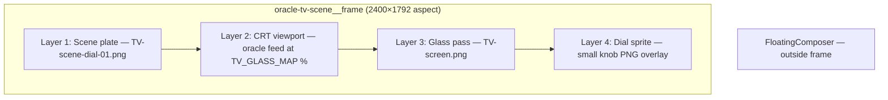
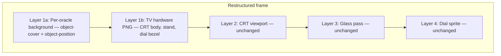

# Oracle Background Swap — Feasibility & Options

> Living document. Saved from intake background exploration (June 2026).
> Related: [remaining-features-plan.md](./remaining-features-plan.md) · [FOR_ETHAN.md](./FOR_ETHAN.md)

## Implementation checklist

- [ ] Choose Option A (aligned plates), B (split comp), or C (prototype first) and TV treatment (same prop vs baked-in)
- [ ] Prepare assets: either 3× 2400×1792 aligned plates OR TV hardware PNG + per-oracle backgrounds with `object-position` values
- [ ] Add per-oracle background/plate map in `tv-scene-assets.ts` and `tv-dial-states.ts`
- [ ] Update `oracle-tv-scene.tsx` with background layer(s) and crossfade on `dialState` change
- [ ] Tune per-oracle `object-position` in browser; verify CRT/glass/dial stay aligned at multiple viewport sizes

---

## The short answer

**Moderate difficulty overall.** Think of it like a VFX comp: the "insert" (oracle text on the CRT) and "glass pass" (reflection overlay) are already locked to a master canvas. Swapping only the background is easy **if** every plate shares the same framing. Your example stills (Lady Bird bedroom, Witch forest) are wide, uncropped, and have no TV in frame — so **asset alignment is the hard part**, not React code.

---

## What already exists

The intake page is a fixed layer stack in [`src/components/intake/oracle-tv-scene.tsx`](../src/components/intake/oracle-tv-scene.tsx):

Key constants in [`src/lib/tv-screen-map.ts`](../src/lib/tv-screen-map.ts):

- Master canvas: **2400 × 1792** (drives `aspectRatio` on the frame)
- CRT cutout: `TV_GLASS_MAP` — percentages measured once from the basement plate (~28.3% left, ~20.1% top, ~45.7% wide)
- Dial hit target: `TV_VOLUME_DIAL_MAP` — also percentage-based
- Plate uses `object-fill` — stretches to fill the frame exactly (no letterboxing)

Dial changes today swap **persona + voice + knob sprite**, but **not** the background plate. [`remaining-features-plan.md`](./remaining-features-plan.md) already planned plate crossfade on channel change — the wiring just was not finished.

---

## Why your example images are tricky

| Property | Current basement plate | Your Lady Bird / Witch stills |
| -------- | ---------------------- | ------------------------------ |
| Aspect ratio | 2400×1792 (~4:3) | Very wide (~2:1 panoramic) |
| TV in frame | Yes, locked position | No TV — room only |
| Framing | TV-forward hero shot | Full room / landscape |
| Dial on TV | Baked into plate | Not present |

If you drop these wide stills into the current frame with `object-fill`, they will **stretch/distort**. If you use `object-cover`, the TV cutout percentages will point at the **wrong pixels** unless each background is cropped/positioned so the TV lands in the same visual slot.

---

## Three viable solutions

### Option A — Full aligned plates (best polish, design-heavy)

**Concept:** Like exporting three versions of the same camera lock-off — same canvas, same TV position, only the room behind it changes.

**Asset workflow:**

1. Use `TV-scene-dial-01.png` (2400×1792) as the alignment template in Figma/Photoshop
2. For each oracle world, composite the film still behind the TV prop (or re-shoot/re-frame so the CRT sits at the same pixel coordinates)
3. Export three plates at exactly **2400×1792**
4. Optionally bake dial knob position per plate (or keep current sprite overlays)

**Code changes (low effort, ~1–2 hrs):**

- Add per-persona plate paths in [`src/lib/tv-scene-assets.ts`](../src/lib/tv-scene-assets.ts) or [`src/lib/tv-dial-states.ts`](../src/lib/tv-dial-states.ts)
- In [`oracle-tv-scene.tsx`](../src/components/intake/oracle-tv-scene.tsx): render two stacked `<Image>` plates, crossfade opacity (~300ms) on `dialState` change
- No changes to `TV_GLASS_MAP` — one map works for all plates

**Pros:** Pixel-perfect; screen/glass/dial never drift; matches existing architecture
**Cons:** Requires design time per oracle; uncropped stills must be reframed first

---

### Option B — Split comp: background + fixed TV prop (best for uncropped stills)

**Concept:** Greenscreen-style post — the **room** is a separate layer; the **TV hardware** is a transparent PNG extracted from the current plate and always sits in the same place.

**Asset workflow:**

1. Extract TV + stand + dial region from `TV-scene-dial-01.png` as a transparent PNG (mask out the black screen — content layer fills that hole)
2. Store per-oracle backgrounds at high res (can stay wide)
3. Tune `object-position` per oracle so the room "frames" nicely behind the TV

**Code changes (medium effort, ~2–4 hrs):**

- Split current plate into `TV_HARDWARE_OVERLAY` + per-oracle `ORACLE_BACKGROUNDS` map
- Add optional per-persona `backgroundPosition` in config (e.g. `"52% 40%"` for Lady Bird door, `"35% 55%"` for Witch hut)
- Background layer: `object-cover` inside the frame; TV prop layer: `absolute inset-0 object-fill`
- Crossfade backgrounds on dial change; TV prop stays static

**Pros:** Works with uncropped film stills; iterate positioning in browser devtools
**Cons:** TV may feel "composited in" if lighting/perspective don't match each room; shadow/reflection mismatch

---

### Option C — CSS prototype first (fastest to try, ~2–3 hrs)

**Concept:** Proof-of-concept before committing to final assets — stack two background images, crossfade on dial, tune `object-position` live.

**Steps:**

1. Drop Lady Bird / Witch stills into `public/a24-assets/oracle-backgrounds/`
2. Add a dev-only or initial config with rough `object-position` per persona
3. Keep the current basement plate as the TV prop layer (Option B lite) OR overlay TV prop only after tuning feels right
4. Validate the effect in browser before asking design for final 2400×1792 exports

**Pros:** See the idea working today with your raw stills
**Cons:** Not shippable quality without follow-up asset pass

---

## Difficulty matrix

| Task | Option A (aligned plates) | Option B (split comp) | Option C (prototype) |
| ---- | ------------------------- | --------------------- | -------------------- |
| Asset prep | High (3 aligned exports) | Medium (1 TV mask + backgrounds) | Low (use raw stills) |
| Code change | Low | Medium | Low–medium |
| TV alignment risk | None if exports are correct | Low with tuning | Medium |
| Visual realism | Highest | Good with careful comp | Rough |
| Matches existing plan | Yes — `remaining-features-plan.md` | Extends plan | Stepping stone |

---

## Recommendation

**Start with Option C → decide A vs B based on what you see.**

1. **Prototype (Option C):** Split the current plate into background + TV prop, crossfade two raw stills behind it, tune `object-position` in devtools. Confirms the dial → world change feels right.
2. **If the comp looks good enough:** Finish Option B with a clean TV hardware PNG and per-oracle position config.
3. **If it feels too "floating":** Invest in Option A — three Figma-aligned 2400×1792 plates where design locks the TV into each world.

---

## Files to touch (when implementing)

| File | Change |
| ---- | ------ |
| [`src/lib/tv-scene-assets.ts`](../src/lib/tv-scene-assets.ts) | Add `ORACLE_SCENE_PLATES` or `ORACLE_BACKGROUNDS` + `TV_HARDWARE_OVERLAY` |
| [`src/lib/tv-dial-states.ts`](../src/lib/tv-dial-states.ts) | Map `TvDialState` / `OraclePersonaId` → plate or background asset |
| [`src/components/intake/oracle-tv-scene.tsx`](../src/components/intake/oracle-tv-scene.tsx) | Crossfade background(s); optionally split plate into bg + TV prop layers |
| [`src/app/globals.css`](../src/app/globals.css) | Crossfade transition classes (`.oracle-tv-scene__plate--fade`) |
| `public/a24-assets/` | New oracle background assets |

**No changes needed** to [`tv-screen-map.ts`](../src/lib/tv-screen-map.ts) if the TV prop stays fixed (Options B/C) or all plates share identical framing (Option A).

---

## Open decisions (pick before build)

1. **TV treatment:** Same basement CRT composited into every world (Option B/C) vs. TV baked into each world's photography (Option A)?
2. **Scope:** All three oracles get unique backgrounds, or prototype Lady Bird + Witch first and keep basement for Channel 1?
3. **Materialists world:** Do you have a third still, or does Lucy stay in the basement / a placeholder?

---

## Effort estimate

- **Prototype you can click through:** ~2–3 hours code + dropping in your two stills
- **Shippable Option B:** ~1 day (half asset extraction/positioning, half code)
- **Shippable Option A:** ~1–2 days design compositing + ~1–2 hours code

The TV staying in the **exact same place** is not a code problem — it's an **asset coordinate problem**. The existing percentage map is the "grid overlay" in post; every background just needs to honor that grid.
