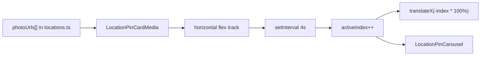
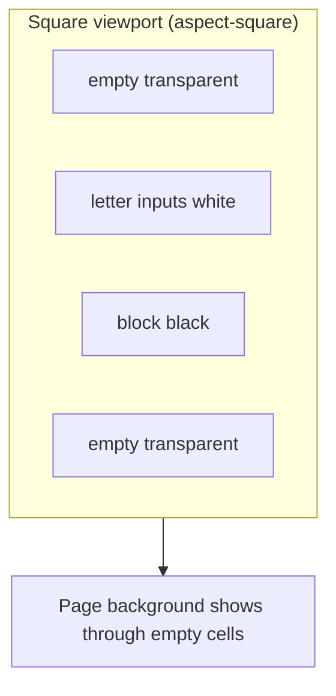
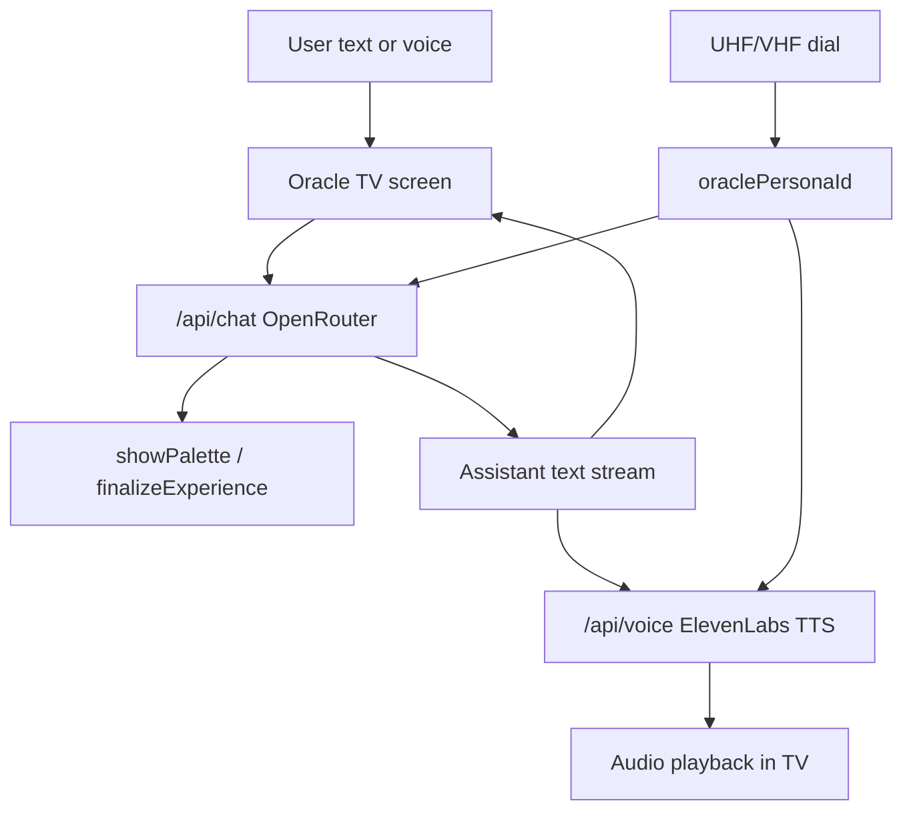
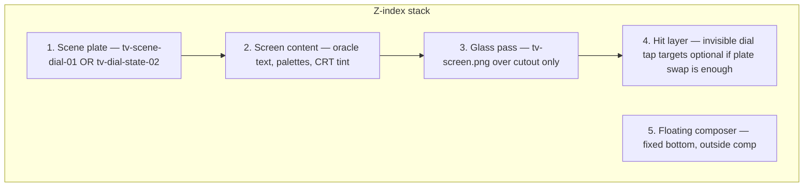

# A24 Remaining Features — Research & Implementation Plan

> Living document. Saved from feature roadmap sync (June 2026).
> Related: [architecture-plan.md](./architecture-plan.md) · Branch: `tv-basement-scene`

## Implementation checklist

- [ ] Add `photoUrls` to `FilmLocation` + populate `locations.ts` (with film fallback helper)
- [ ] Wire location card autoplay slide (RTL) + dynamic carousel dots in `location-pin-card.tsx`
- [ ] Refactor crossword `buildGrid` to letter/block/empty; pad to square; transparent empty cells
- [ ] Square aspect-ratio crossword container, fluid cells, float/center grid
- [ ] Add `/api/voice` route + client playback hook on assistant message complete
- [ ] Create `oracle-personas.ts`; extend `buildSystemPrompt(personaId)` + chat route body
- [ ] Copy TV assets to `public/a24-assets/tv/`; measure `screenMap`
- [ ] Layered `oracle-tv-scene` — plate crossfade, screen content, glass overlay, floating composer
- [ ] Optional: push-to-talk STT on TV bezel feeding existing `sendMessage`

---

## Current state (what you already have)

| Feature        | Status |
| -------------- | ------ |
| Location cards | `src/components/games/location-pin-card.tsx` renders one `photoUrl`; carousel dots are a **placeholder** (`activeIndex={0}`, no slide logic) |
| Crossword      | `src/components/games/crossword.tsx` uses fixed `size-9` cells; null cells render as **black blocks**; grid is rectangular, not square or floating |
| Oracle         | `src/components/intake/oracle-chat.tsx` + OpenRouter via `src/app/api/chat/route.ts`; **text only**, single persona in `src/lib/oracle-prompt.ts` |

Think of the app today like a film set with great props but three unfinished beats: the location cards show one still when you need a B-roll montage, the crossword sits on a flat matte instead of floating in frame, and the oracle reads from a script instead of performing on a TV in a living room.

---

## Feature 1: Location card photo carousel (right-to-left auto-slide)

### Photos vs. user data — two different problems

**Photo bytes:** stay on the server in `public/a24-assets/` (or later object storage). A database does not need to hold image files for the carousel to work.

**User/account data:** a database *does* make sense for conversation persistence, favorited palettes, and resumable sessions — but that is **out of scope for the current vertical slice** (architecture doc already defers this to Vercel KV / shareable sessions).

| Layer              | Vertical slice (now)                         | Post-slice (your direction)                       |
| ------------------ | -------------------------------------------- | ------------------------------------------------- |
| Location stills    | `photoUrls[]` in `src/data/locations.ts`     | Same; optional CMS later                          |
| Oracle transcript  | Ephemeral React state                        | DB row per session                                |
| Favorited palettes | Not built                                    | `user_id + film_id` join table                    |
| Auth               | None today                                   | Better Auth / Supabase Auth when favorites matter |

**Carousel does not block on a database.** It only needs an array of path strings wired to the existing placeholder UI (~1–2 hours including data cleanup).

### Carousel effort estimate

**Yes — quick add.** Stub already exists (dots, media wrapper, CSS). Remaining work: extend types, list URLs in data, ~40 lines of slide logic + interval in `location-pin-card.tsx`. No new dependencies.

### Data model change

Extend `FilmLocation` in `src/lib/types.ts`:

```typescript
export interface FilmLocation {
  // ...
  photoUrl: string;           // keep as primary / quiz still
  photoUrls?: string[];       // carousel gallery (expanded card)
}
```

Populate in `src/data/locations.ts`. Suggested default when `photoUrls` is omitted:

```typescript
photoUrls ?? [photoUrl, ...filmStillsForFilm(filmId)]
```

That gives you per-location galleries when you have them, and **film-wide fallback** (e.g. all 4 Backrooms stills on any Backrooms pin) without duplicating paths everywhere.

### Carousel implementation (no new library required)

The placeholder in `location-pin-card.tsx` already has segment dots — wire them to real state.

**Recommended pattern: CSS transform slide + `setInterval`**



- **Right-to-left feel:** track moves left (`translateX(-activeIndex * 100%)`) so the next image enters from the right
- **Transition:** `transition-transform duration-700 ease-in-out` on the track
- **Accessibility:** `prefers-reduced-motion` → show first image only, hide autoplay
- **Performance:** `next/image` with `fill` + `sizes="260px"` (already used); preload next image optionally
- **Pause on hover** (expanded card only) — nice polish for map popups

**Skip Embla/Swiper** unless you later need swipe gestures. Autoplay-only carousels are ~40 lines of React + CSS.

### Files to touch

- `src/lib/types.ts` — add `photoUrls?`
- `src/data/locations.ts` — group stills per location or film
- `src/components/games/location-pin-card.tsx` — slide track + interval + dynamic dot count
- `src/app/globals.css` — `.location-pin-card__media-track` overflow hidden

Quiz still in `location-quiz.tsx` can keep using single `photoUrl` (hero shot, not carousel).

---

## Feature 2: Floating max-sized square crossword with transparent padding

### The visual goal

Imagine the crossword as a **square matte floating above the page** — like a title card in post. Only **letter cells** read as solid white squares. **Intentional black blocks** stay black. Everything else in the square frame is **see-through**, so the puzzle feels custom-shaped rather than boxed in a rectangle.

### Why today's grid fights that illusion

In `crossword.tsx`, `buildGrid()` marks any non-letter cell as `null`, and null renders as `size-9 bg-black`.

Two problems:

1. **Fixed `size-9`** — grid size is `rows × cols × 36px`, not a max square
2. **Single null type** — cannot distinguish *black block* vs *transparent padding*

### Three cell states (core design decision)

| State    | Meaning                                   | Render                          |
| -------- | ----------------------------------------- | ------------------------------- |
| `letter` | Part of a word                            | White `<input>`                 |
| `block`  | Traditional black square inside puzzle    | `bg-black`                      |
| `empty`  | Square padding outside active puzzle area | `transparent` (no visible cell) |

**How to get `block` vs `empty`:**

- **Option A (recommended):** Pad the grid to `size = max(rows, cols)`, center the existing puzzle, mark padding cells as `empty`. Internal nulls from word coverage stay `block`.
- **Option B:** Pass `layout.table` from `crossword-layout-generator` through `game.ts` — `"-"` = block, outside bounds = empty. More accurate if generator adds blocks not covered by word paths.

For hackathon speed, **Option A** is enough: the generator already trims to a tight bounding box; padding to square creates the "floating shape" effect.

### Square + floating layout

Changes in `src/components/games/crossword.tsx`:

1. **Pad grid** to square dimensions in `buildGrid()` (or a `padToSquare()` helper)
2. **Container:** `aspect-square w-full max-w-[min(72vw,55dvh,28rem)] mx-auto`
3. **Grid tracks:** both `gridTemplateColumns` and `gridTemplateRows` as `repeat(n, 1fr)`
4. **Cells:** replace `size-9` with `aspect-square w-full h-full min-h-0`
5. **Remove chrome:** drop `bg-white/10 p-px` on the grid wrapper (or make transparent)
6. **Float:** wrap grid in a layer with `relative z-10` and optional subtle `drop-shadow` on letter cells only — clues stay in normal document flow beside/below



### What stays unchanged

- `src/lib/game.ts` layout generation
- Keyboard navigation, scoring, clue lists
- `src/data/crosswordBank.ts`

Optional polish: on mobile, stack clues below the square; on desktop, clues to the right with grid centered in left column.

---

## Feature 3: Oracle TV room + ElevenLabs voice + three personas

### Architecture: voice is a presentation layer

The existing tool-calling pipeline (`showPalette`, `finalizeExperience`) should **not** change. Voice and persona are **how** the oracle performs, not **what** it decides.



### ElevenLabs integration (hackathon-friendly)

**Server route** (keeps API key off client): new `src/app/api/voice/route.ts`

- Input: `{ text: string, voiceId: string }`
- Call ElevenLabs `POST /v1/text-to-speech/{voice_id}` with `Accept: audio/mpeg`
- Return `Response` with audio stream
- Env: `ELEVENLABS_API_KEY`, default voice IDs per persona

**Client hook** in `oracle-chat.tsx`:

- When assistant message finishes streaming (`status` → `ready`), send full text to `/api/voice`
- Play via `HTMLAudioElement` or `AudioContext`
- UI states: thinking → speaking (subtle CRT scanline pulse or speaker icon)
- Pre-generate or cache: opening line + `Generating` line *"I think I see you now."*

**Voice input (STT) — phase 2:**

- Fastest hackathon path: **Web Speech API** (`webkitSpeechRecognition`) → transcript → existing `sendMessage({ text })`
- ElevenLabs Scribe if you want one vendor; slightly more setup
- Push-to-talk button on the TV bezel (fits the remote-control metaphor)

**Latency tip:** TTS after full turn is simplest and matches `stopWhen: stepCountIs(1)` in chat route. Sentence-chunk streaming TTS is smoother but more work.

### Three oracle personas

New file: `src/lib/oracle-personas.ts`

| Persona        | Film anchor    | Voice character                               | Prompt flavor                              |
| -------------- | -------------- | --------------------------------------------- | ------------------------------------------ |
| `ladybird_mom` | *Lady Bird*    | Warm, slightly rushed, affectionate bluntness | Suburban honesty, coming-of-age tenderness |
| `witch`        | *The Witch*    | Low, deliberate, archaic                      | Ominous spareness, nature and dread        |
| `materialist`  | *Materialists* | Crisp, analytical, modern                     | Dating-market pragmatism, soft cynicism    |

Each persona exports:

- `id`, `label`, `dialPosition` (UHF/VHF channel number)
- `elevenLabsVoiceId` (pick 3 distinct voices from ElevenLabs library)
- `buildPersonaPrompt(baseCatalog: string)` — wraps shared catalog + persona voice rules

**Persona selection logic (two triggers):**

1. **Auto-assign:** After enough conversation, map `selectedFilmIds` + moods to default persona
2. **Manual override:** Dial on CRT TV switches `personaId` — next API request sends `personaId` in body; server calls `buildSystemPrompt(personaId)`

Dial switch mid-chat: keep message history, inject persona change as a system note — no need to reset `useChat`.

Extend `src/app/api/chat/route.ts` to accept `{ personaId?: string }` alongside messages.

### TV living room UI — layered asset stack

**Branch:** `tv-basement-scene`

#### Asset registry

| File (source)          | Target path                                  | Role |
| ---------------------- | -------------------------------------------- | ---- |
| `TV-scene-dial-01`     | `public/a24-assets/tv/tv-scene-dial-01.webp` | **Background plate** — full scene at default framing. Also **dial state 1** (initial knob positions). Base layer for the entire intake viewport. |
| `TV-dial-state-02.jpg` | `public/a24-assets/tv/tv-dial-state-02.webp` | **Dial state 2** — same scene, knobs rotated. Swapped (or crossfaded) when user changes oracle channel/persona. Proves the dial interaction diegetically without CSS knob sprites. |
| `TV-screen.png`        | `public/a24-assets/tv/tv-screen.png`         | **CRT glass overlay** — reflection/transparency layer sized to the screen cutout. Sits **above** oracle UI content. Adds glass glare, bezel edge, and sells depth. Keep PNG for alpha. |

**Future asset (not yet delivered):** `TV-dial-state-03` — third knob position for the third persona (`materialist`). Until then: 2 visual states map to 2 personas, or state-02 cycles through persona 2 ↔ 3 with voice/prompt change only.

#### Compositing stack (bottom → top)

Think of it like a VFX comp in post — background plate, content insert, glass pass:



```tsx
<div className="oracle-tv-scene relative min-h-dvh w-full overflow-hidden">
  {/* Layer 1: scene plate — crossfade on persona change */}
  <ScenePlate src={dialState === 1 ? dial01 : dial02} />

  {/* Layer 2: oracle viewport — mapped to black cutout */}
  <div className="tv-screen-content absolute" style={screenMap}>
    <TvOracleFeed />  {/* OracleLine, compact PaletteCard, speak pulse */}
  </div>

  {/* Layer 3: CRT glass reflection — PNG alpha, pointer-events-none */}
  

  <FloatingComposer />
</div>
```

- **Plate swap:** `opacity` crossfade (~300ms) between dial states when dial clicked — no rotation animation required for v1
- **Glass layer:** same `screenMap` rect as content; `object-fit: fill` to align with cutout; optional `mix-blend-mode: screen` if glare needs boost
- **Screen map:** measure once from `TV-scene-dial-01` → `src/lib/tv-screen-map.ts` (`top`, `left`, `width`, `height` as %). Dial states must share identical framing so plate swap does not drift

#### Split broadcast from input

| Zone                            | What lives there                                                  |
| ------------------------------- | ----------------------------------------------------------------- |
| **TV screen content (layer 2)** | Oracle text only, compact palette bars, thinking/speaking state   |
| **TV-screen.png (layer 3)**   | Visual only — reflections; no interaction                         |
| **Scene plate (layer 1)**     | Room + TV + dial position; swaps on channel change                |
| **Floating composer**         | Textarea, Send, mic — off-camera, bottom of viewport              |

User messages do **not** appear on the TV.

#### Responsive framing

`TV-scene-dial-01` is already TV-forward (tighter than the full shag-carpet square). Use as `object-fit: cover` hero — less aggressive mobile crop needed than the wide living-room master.

#### Dial state → persona mapping (draft)

| Visual state  | Asset              | Persona (draft)  |
| ------------- | ------------------ | ---------------- |
| State 1       | `tv-scene-dial-01` | `ladybird_mom`   |
| State 2       | `tv-dial-state-02` | `witch`          |
| State 3 (TBD) | future export      | `materialist`    |

Interaction: click/tap on dial region in scene → cycle state → swap plate + `personaId` + ElevenLabs voice on next turn.

#### New / updated files

- `public/a24-assets/tv/` — all three assets above (WebP for plates, PNG for glass)
- `src/lib/tv-screen-map.ts` — cutout rect + optional dial hit regions
- `src/lib/tv-dial-states.ts` — maps `personaId` ↔ plate asset path
- `src/components/intake/oracle-tv-scene.tsx` — layer stack + plate crossfade
- `src/components/intake/tv-oracle-feed.tsx` — oracle output inside screen
- `src/components/intake/floating-composer.tsx` — input bar
- Refactor `oracle-chat.tsx` → `useOracleChat()` hook + scene composition

Replace `AppShell` centered layout during `intake` in `experience.tsx`.

#### Scope guard

- No CSS 3D CRT replica — plates + glass PNG handle realism
- No knob rotation sprites — photographic state swaps only (until state-03 exists)
- Full chat scroll stays out of the screen; teleprompter-style current oracle line(s) only

---

## Recommended phasing

| Priority      | Feature                                             | Effort    | Demo impact                    |
| ------------- | --------------------------------------------------- | --------- | ------------------------------ |
| **Quick win** | Location carousel (`photoUrls` + CSS slide)         | ~1–2 hrs  | Ship anytime; low risk         |
| **P0**        | ElevenLabs TTS on oracle replies                    | ~2–3 hrs  | Direct hackathon tie-in        |
| **P0**        | Persona registry + dial switches voice + prompt     | ~2–3 hrs  | Shows "character" not just TTS |
| **P1**        | TV scene layer stack (plates + glass + screen feed) | ~3–4 hrs  | Strong visual story            |
| **P2**        | Crossword transparent square float                  | ~2–3 hrs  | Portfolio polish               |
| **P3**        | Voice input (Web Speech push-to-talk)               | ~1–2 hrs  | TV bezel affordance            |
| **Later**     | Auth + conversation persistence + palette favorites | Multi-day | Post vertical slice            |

**Minimum viable hackathon demo:** Oracle speaks in 3 switchable voices inside a CRT frame; games still generate from the same tool pipeline.

---

## Dependencies to add

```bash
bun add @elevenlabs/elevenlabs-js   # optional; fetch API works without SDK
```

Env additions to `.env.example`:

```
ELEVENLABS_API_KEY=
ELEVENLABS_VOICE_LADYBIRD=
ELEVENLABS_VOICE_WITCH=
ELEVENLABS_VOICE_MATERIALIST=
```

No new deps required for carousel or crossword.

---

## Risks and mitigations

| Risk                                       | Mitigation                                                         |
| ------------------------------------------ | ------------------------------------------------------------------ |
| TTS latency after each reply               | Show "speaking" state; cache opening + generating lines            |
| Autoplay blocked by browser                | First user click (Send) unlocks audio context                      |
| Persona switch confuses LLM                | Short system injection on dial change; keep catalog identical      |
| Crossword `empty` cells break keyboard nav | Run `isCell()` only on `letter` cells; skip `empty` in arrow keys  |
| Missing image files in `public/a24-assets` | Audit paths in `locations.ts`; carousel falls back to `photoUrl`   |

---

## After implementation

Update [FOR_ETHAN.md](./FOR_ETHAN.md) with:

- **Cast & Crew:** carousel as B-roll reel on location cards; crossword as floating matte; oracle as TV broadcast with three channels
- **Behind the Scenes:** photos on disk vs. user data in DB (different layers); voice as presentation-layer only
- **Director's Commentary:** ElevenLabs as post-production voice-over on the same script
