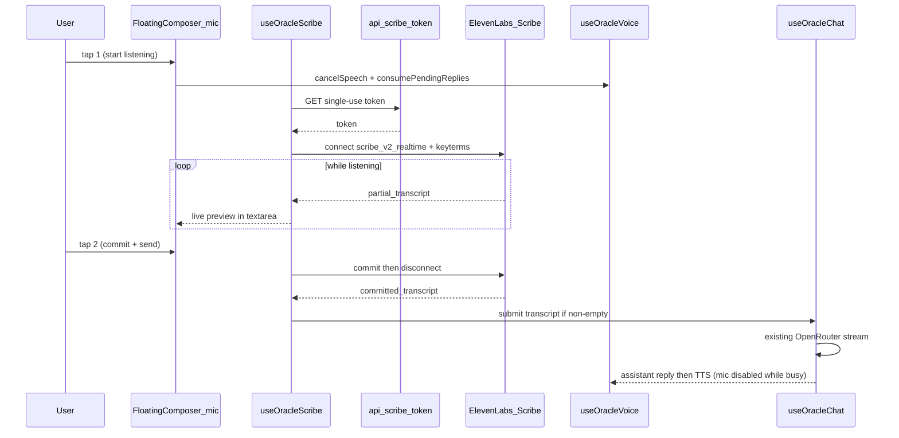

# Scribe Realtime Voice Input Plan

> Living document. Saved June 2026.

## Decisions locked (June 2026)

Resolved with Ethan before implementation:

- **Mic gesture:** tap-to-toggle (tap to start listening, tap again to commit + auto-send). Not hold-to-talk.
- **Send behavior:** auto-send on the second tap (commit → if non-empty → `chat.submit`). No separate Send press.
- **Live preview:** partials stream into the existing composer textarea (most legible — text appears where "what I'm about to send" already lives).
- **Token endpoint:** ship demo without auth now; leave a clear hardening hook + TODO before any public deploy ("public but later").
- **Turn-taking / no barge-in:** see [Turn-taking model](#turn-taking-model-no-mid-reply-barge-in). Mic disabled while the model is replying; any reply the user talks over is permanently dropped.
- **Pre-code step:** install the packages and read the real `@elevenlabs/*` API in `node_modules` first — do not trust the API snippets below until verified against the installed SDK version.

## Implementation checklist

- [ ] Install `@elevenlabs/react` + `@elevenlabs/elevenlabs-js` via bun, then **read the installed SDK docs in `node_modules`** to confirm the real `useScribe` / `CommitStrategy` / token-mint API before coding
- [ ] Create `src/lib/scribe-keyterms.ts` from films + locations catalog
- [ ] Create `GET src/app/api/scribe-token/route.ts` (single-use realtime token; add `// TODO: harden before public` + a guard seam)
- [ ] Create `src/hooks/use-oracle-scribe.ts` wrapping `useScribe` with tap-to-toggle + auto-send
- [ ] Export `cancelSpeech` + `consumePendingReplies` from `use-oracle-voice.ts` (see [Turn-taking model](#turn-taking-model-no-mid-reply-barge-in))
- [ ] Add tap-to-toggle mic button and scribe states to `floating-composer.tsx`; disable mic while `chat.busy`
- [ ] Wire hook in `oracle-tv-scene.tsx` (textarea preview, auto-submit, turn-taking guards)
- [ ] Update `.env.example` comment and `docs/FOR_ETHAN.md`
- [ ] Manual verification: film names, no mid-reply barge-in, busy guard, missing key

---

## Goal

Let users **talk to the TV characters** instead of only typing. Speech is captured in near-real-time (~150ms partials), biased toward A24 proper nouns, and **auto-sent to the oracle on mic release** when the committed transcript is non-empty.

The existing chat + TTS stack stays intact — STT is a new **input bus** into the same `sendMessage({ text })` splice.



## Why realtime Scribe (not batch upload)

| Approach                               | Latency feel                        | Fit                               |
| -------------------------------------- | ----------------------------------- | --------------------------------- |
| Batch `scribe_v2` (record blob → POST) | Wait until utterance ends + upload  | Too “walkie-talkie with delay”    |
| **Realtime `scribe_v2_realtime`**      | Partial words appear while speaking | Matches “as realtime as possible” |

Use **`CommitStrategy.MANUAL`** with tap-to-toggle: tap 1 opens the mic and partials stream live; tap 2 fires `commit()` to finalize the utterance before auto-send. Avoid always-on VAD — it would pick up TV speaker bleed from [`useOracleVoice`](../src/hooks/use-oracle-voice.ts).

> **Toggle vs. hold note:** toggle keeps the mic open between taps, so the TV speaker-bleed risk that hold-to-talk sidesteps comes back. We mitigate it the same way: tap 1 calls `cancelSpeech()` to silence the character and keeps the mic gated by `echoCancellation` while open. See [Turn-taking model](#turn-taking-model-no-mid-reply-barge-in).

## Dependencies (new)

Install with bun (project convention):

```bash
bun add @elevenlabs/react @elevenlabs/elevenlabs-js
```

- **`@elevenlabs/elevenlabs-js`** — server-only token minting in API route
- **`@elevenlabs/react`** — `useScribe` hook for browser mic streaming

No change to existing TTS route pattern in [`src/app/api/voice/route.ts`](../src/app/api/voice/route.ts) — same `ELEVENLABS_API_KEY`.

## New server route: scribe token

**File:** [`src/app/api/scribe-token/route.ts`](../src/app/api/scribe-token/route.ts)

- `GET` handler (or `POST` if you prefer explicit intent)
- Requires `ELEVENLABS_API_KEY`; return `503` with clear message if missing (mirror voice route)
- Use `ElevenLabsClient` to create a **single-use realtime token**:

```typescript
// Verified against @elevenlabs/elevenlabs-js@2.51.0:
// create() returns SingleUseTokenResponseModel = { token: string } (an OBJECT).
const { token } = await elevenlabs.tokens.singleUse.create('realtime_scribe');
return Response.json({ token });
```

> **Gotcha (verified):** the mint returns `{ token }`, not a bare string. The client must unwrap `data.token` before passing it to `scribe.connect({ token })` — passing the whole response would send `[object Object]` as the auth token.

- Tokens expire in ~15 minutes — fine for toggle sessions; fetch fresh token on each tap-1
- **Decision: "public but later."** Ship the demo without auth, but the route mints ElevenLabs tokens against your key with no gate — a real cost/abuse vector once public. Leave a single, obvious guard seam (e.g. an early `requireScribeAccess(req)` no-op + `// TODO: harden before public deploy — rate-limit / origin check / shared secret`) so the follow-up is small and unmissable.

## Keyterms from catalog

**File:** [`src/lib/scribe-keyterms.ts`](../src/lib/scribe-keyterms.ts)

Build a deduped list (max **100** terms per Scribe API) from existing data:

| Source                                              | Examples                                                    |
| --------------------------------------------------- | ----------------------------------------------------------- |
| [`src/data/films.ts`](../src/data/films.ts)         | titles, directors, split `"Josh & Benny Safdie"` into parts |
| [`src/data/locations.ts`](../src/data/locations.ts) | `neighborhood`, `venueLabel` if present                     |
| Personas                                            | `"A24"`, `"Lady Bird"`, `"Materialists"`, `"The Witch"`     |

Export `buildScribeKeyterms(): string[]` — used client-side when connecting Scribe (not secret data).

## New hook: `useOracleScribe`

**File:** [`src/hooks/use-oracle-scribe.ts`](../src/hooks/use-oracle-scribe.ts)

Wrap `useScribe` from `@elevenlabs/react` with oracle-specific behavior:

**Inputs**

- `onPartial(text)` — update composer preview while holding mic
- `onCommitted(text)` — final utterance on release
- `onSubmit(text)` — call `chat.submit(text)` when committed text is non-empty
- `disabled` — true when `chat.busy` (mic is locked out while the model is replying)
- `onStartListening` — call `voice.cancelSpeech()` **and** `voice.consumePendingReplies()` to silence the character and drop any reply the user is talking over (see [Turn-taking model](#turn-taking-model-no-mid-reply-barge-in))
- `keyterms` — from `buildScribeKeyterms()`

**Scribe config** (option names verified against `@elevenlabs/react@1.6.4` `scribe.d.ts`)

- `modelId: "scribe_v2_realtime"` — ✅ confirmed verbatim (ElevenLabs models docs); ~150ms partial latency
- `commitStrategy: CommitStrategy.MANUAL` — ✅ confirmed enum, and it's the SDK default
- `noVerbatim: true` — ✅ option exists; cleaner committed lines (drops filler)
- `microphone: { echoCancellation: true, noiseSuppression: true, autoGainControl: true }` — ✅ exact keys (`client/runtime.d.ts`)
- `languageCode: "eng"` — ✅ confirmed valid; SDK accepts ISO-639-1 (`"en"`) **or** ISO-639-3 (`"eng"`) per `client/.../scribe.d.ts:51`. Model also does automatic language recognition, so this is just a bias hint.

**Verified hook surface** (`UseScribeReturn`)

- Drive **auto-send** off the `onCommittedTranscript({ text })` callback (cleanest single-utterance signal).
- `partialTranscript: string` is also exposed as state — but we'll push partials via the `onPartialTranscript` callback into `chat.setText`.
- `committedTranscripts: TranscriptSegment[]` **accumulates** across a session → call **`clearTranscripts()`** on disconnect so a stale segment can't leak into the next take.
- `scribeError` maps to the hook's `error: string | null`; granular callbacks (`onAuthError`, `onQuotaExceededError`, `onRateLimitedError`, …) available if we want specific messaging.
- **Config split:** pass static config + callbacks at `useScribe(options)` init; pass only the **fresh token** at `connect({ token })` time (`connect` accepts `Partial<ScribeHookOptions>`). Keep `autoConnect` off.

**Tap-to-toggle lifecycle**

1. **Tap 1 (idle → listening)** → `cancelSpeech()` + `consumePendingReplies()` → fetch `/api/scribe-token` → `scribe.connect({ token, ... })`
2. **While listening** → `onPartialTranscript` → `setText(partial)` (live text in composer textarea)
3. **Tap 2 (listening → idle)** → `scribe.commit()` → wait for `onCommittedTranscript` → `onSubmit(committed)` if trimmed non-empty → `scribe.disconnect()`
4. **Error / permission denied** → surface `scribeError` string (parallel to `voiceError`)

**Active-state check** (from ElevenLabs docs): treat both `"connected"` and `"transcribing"` as listening — avoids UI flicker on VAD-internal transitions.

**Guards**

- Ignore mic press when `busy` (model “on air”)
- Cancel in-flight token fetch if user releases before connect completes
- Clear partial preview text after successful auto-send

## UI: mic button on floating composer

**File:** [`src/components/intake/floating-composer.tsx`](../src/components/intake/floating-composer.tsx)

Add a **tap-to-toggle** mic control beside Send:

- Single `onClick` toggles between idle and listening (no press-and-hold). A clear "live" indicator is required so users know the mic is still open.
- Disable the mic button whenever `chat.busy` (`submitted`/`streaming`) — enforces no mid-reply barge-in
- Visual states: idle → connecting → listening (pulse) → transcribing
- `aria-pressed` reflects listening state; label toggles e.g. “Speak to the oracle” / “Stop and send”
- Keep textarea + Send as fallback; typed flow unchanged
- Show `scribeError` in the same alert strip as `voiceError`
- While listening, partial text streams into the composer textarea (muted style optional via CSS class)

**File:** [`src/components/intake/oracle-tv-scene.tsx`](../src/components/intake/oracle-tv-scene.tsx)

Wire the pieces:

```typescript
const voice = useOracleVoice({ ... });
const scribe = useOracleScribe({
  disabled: chat.busy,
  onPartial: chat.setText,
  onSubmit: chat.submit,
  onStartListening: () => {
    voice.cancelSpeech();          // abort in-flight / playing TTS
    voice.consumePendingReplies(); // permanently drop any reply being talked over
  },
});
// pass scribe handlers + errors into FloatingComposer
```

## Turn-taking model (no mid-reply barge-in)

The TV character must never start talking _while the user is composing_. The existing TTS is **reactive** — a `useEffect` (`use-oracle-voice.ts:151`) fires when a reply finishes streaming (`status === "ready"`), decoupled from the send action. That opens two failure windows the design must close:

| Window                                                                        | What happens                                                                                                     | Guard                                                                                                                                                          |
| ----------------------------------------------------------------------------- | ---------------------------------------------------------------------------------------------------------------- | -------------------------------------------------------------------------------------------------------------------------------------------------------------- |
| Reply still streaming when user wants to talk                                 | Stream completes mid-compose → TTS fires over the user                                                           | **Mic disabled while `chat.busy`** — user can't even start composing until the reply lands                                                                     |
| Reply finished but TTS audio still synthesizing (the `/api/voice` round-trip) | `stopPlayback` alone won't stop it — an in-flight synth fetch isn't cancelled by it, so it plays once it returns | **`cancelSpeech()`** on tap 1 — bumps `speakGenerationRef` **and** stops playback, discarding the take                                                         |
| Reactive effect re-voices a pre-compose reply later                           | The effect would still try to speak a reply the user talked over                                                 | **`consumePendingReplies()`** on tap 1 — records all present assistant-message ids as already-spoken, so only replies that arrive _after_ send are ever voiced |

Two distinct failure points → two distinct guards. Cancelling the in-flight take (lifecycle) and consuming stale message ids (identity) do different jobs; you need both. Net behavior: **anything the character was about to say when the user grabs the mic is permanently dropped**, and the user can't interrupt a reply that's still forming.

## Extend the voice hook

**File:** [`src/hooks/use-oracle-voice.ts`](../src/hooks/use-oracle-voice.ts)

Today the hook only returns `{ isSpeaking, voiceError, clearVoiceError }`. Add:

- **`cancelSpeech()`** — like the internal `stopPlayback` (line 42) but **also** increments `speakGenerationRef` so a synth fetch already in flight is discarded when it resolves (the current `stopPlayback` does not do this — that's the latency-window bug).
- **`consumePendingReplies()`** — record every current assistant message id into `lastSpokenMessageId`'s tracking so the reactive speak-effect skips them forever. _(~6 lines — the heart of "user takes the floor"; left for Ethan to implement.)_

## Env and docs

- [`.env.example`](../.env.example) — add comment that `ELEVENLABS_API_KEY` covers both TTS and Scribe (no new env vars required)
- [`docs/FOR_ETHAN.md`](./FOR_ETHAN.md) — new subsection under Basement TV: input track (Scribe realtime, keyterms, push-to-talk, auto-send, TTS interrupt)

## CSS polish (minimal)

**File:** [`src/app/globals.css`](../src/app/globals.css) (oracle-tv-composer block)

- `.oracle-tv-composer__mic--listening` pulse (reuse existing phosphor-green palette)
- `prefers-reduced-motion`: static indicator instead of pulse

## Verification checklist

Manual test on **localhost** (mic requires secure context; localhost qualifies):

1. Tap mic → partial words appear in textarea while speaking film names (“Lady Bird”, “Materialists”, “Robert Eggers”)
2. Tap again → message auto-sends; oracle responds; TTS plays on TV
3. Tap mic **while character is speaking** → TTS stops immediately; STT works
4. Mic disabled while `status === "streaming" | "submitted"` (no mid-reply barge-in)
   4b. Tap mic in the gap between reply-finished and TTS-audio-starting → the synth take is dropped, no audio plays over compose (verifies `cancelSpeech` + `consumePendingReplies`)
5. Missing `ELEVENLABS_API_KEY` → friendly 503 on token route; composer shows error
6. Denied mic permission → clear error, typed input still works
7. Safari + Chrome — same Scribe behavior (cross-browser consistency win)

## Out of scope (deliberate)

- Always-on hot mic / VAD listening (echo risk with TV speaker)
- `@elevenlabs/client` without React (unnecessary if `useScribe` covers the hook)
- Speech Engine full-duplex (replaces OpenRouter pipeline)
- Server-side batch `/api/transcribe` (higher latency than realtime for this UX)
- Auth/rate-limit on token endpoint (defer until needed)

## Risk notes

| Risk                             | Mitigation                                                                                                                                                                      |
| -------------------------------- | ------------------------------------------------------------------------------------------------------------------------------------------------------------------------------- |
| TV speaker bleed into mic        | Push-to-talk + echo cancellation; stop TTS on mic press                                                                                                                         |
| Auto-send sends wrong transcript | `noVerbatim` + keyterms reduce errors; user can still type to correct on next turn                                                                                              |
| Token fetch latency on press     | Show “connecting” state immediately; typical connect is fast                                                                                                                    |
| keyterm cap                      | Generous — Scribe v2 supports up to 1000 terms; realtime variant unspecified but our catalog is ~30–40 terms, so well clear. Slice defensively only if it ever grows past ~100. |
