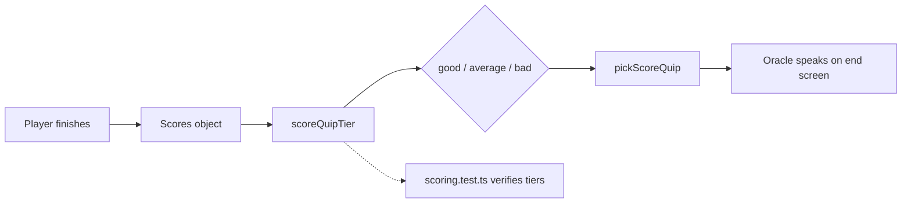
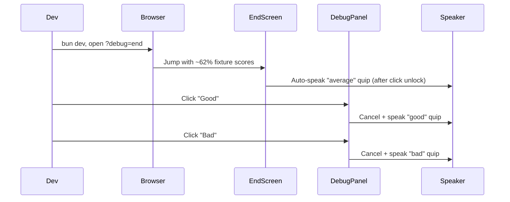

# Tour of Testing Logic

A walkthrough of the unit tests added in commit `d48ef4d` (*Implement end screen with oracle features and debug panels*), what they protect, what’s still uncovered, and how developers can preview score tiers without playing through the full experience.

---

## The Big Picture

When a player finishes the puzzle, raw scores arrive as a `Scores` object split across two minigames (location quiz + crossword). Before any oracle voice line plays, those numbers pass through a **grading LUT** — `scoreQuipTier()` — that maps overall performance into one of three reaction bands:

| Tier | Threshold | Oracle use |
| ---- | --------- | ---------- |
| `good` | ≥ 65% correct | Praise / devotee energy |
| `average` | ≥ 40% correct | Middle-of-the-road quip |
| `bad` | < 40% correct | Gentle roast / encouragement |

Think of it like a **color grade LUT** in post: the footage (scores) stays the same structurally, but the LUT decides which emotional grade gets applied before it hits the screen (the end-screen speaker).



The tier then flows into `EndScreenWithOracle`, which picks persona-specific copy and speaks it:

```ts
const tier = scoreQuipTier(scores);
const line = pickScoreQuip(personaId, tier);
```

The commit added **one test file** to lock down that LUT. Everything else in the commit — debug panels, oracle quip copy, hooks — is exercised manually via dev tooling, not automated tests.

---

## What Was Added

| File | Role |
| ---- | ---- |
| `src/lib/scoring.test.ts` | Unit tests for `scoreQuipTier()` |
| `src/lib/scoring.ts` | New `scoreQuipTier()`, shared `scoreRatio()` helper |

Run the suite:

```bash
bun test
```

(`package.json` maps `"test"` → `bun test`.)

---

## The Test File: `scoring.test.ts`

### Runner

Uses Bun’s built-in test API — no Vitest or Jest:

```ts
import { describe, expect, test } from "bun:test";
```

### The `Scores` shape

Production scores are **not** a single number. They track two games independently:

```ts
interface Scores {
  location: number;
  locationTotal: number;
  crossword: number;
  crosswordTotal: number;
}
```

`scoreRatio()` sums both sides before dividing, so the tier reflects **combined** performance across minigames.

### The `scores()` helper

Tests don’t pass a bare percentage. The helper builds a realistic `Scores` object by splitting `correct` and `total` across location and crossword:

```ts
function scores(correct: number, total: number): Scores {
  const half = Math.floor(total / 2);
  return {
    location: Math.floor(correct / 2),
    locationTotal: half,
    crossword: correct - Math.floor(correct / 2),
    crosswordTotal: total - half,
  };
}
```

For `total = 20`, that yields 10 location slots and 10 crossword slots. The ratio should match `correct / total` regardless of the split — but using the real struct guards against a future bug where only one game gets counted.

### The function under test

```ts
export function scoreQuipTier(scores: Scores): ScoreQuipTier {
  const ratio = scoreRatio(scores);
  if (ratio >= 0.65) return "good";
  if (ratio >= 0.4) return "average";
  return "bad";
}
```

`scoreRatio()` was also extracted (refactored out of `fanTier()`) so both tier mappers share one source of truth for the math.

---

## The Three Test Cases

All cases use a **20-question** total so percentages read cleanly.

### 1. `"good"` — at and above 65%

```ts
test("good at 65% or above", () => {
  expect(scoreQuipTier(scores(13, 20))).toBe("good"); // 65% — inclusive boundary
  expect(scoreQuipTier(scores(18, 20))).toBe("good"); // 90% — well inside band
});
```

- `13/20 = 0.65` hits the `>= 0.65` threshold exactly (inclusive).
- `18/20 = 0.90` is deep in the band.

This lower bound aligns with the `"Letterboxd Devotee"` tier in `fanTier()` (also `>= 0.65`), so voice quips and fan-title copy stay in the same performance neighborhood.

### 2. `"average"` — between 40% and 64%

```ts
test("average between 40% and 64%", () => {
  expect(scoreQuipTier(scores(10, 20))).toBe("average"); // 50%
  expect(scoreQuipTier(scores(8, 20))).toBe("average");  // 40% — inclusive boundary
});
```

- `10/20 = 0.50` — middle of the band.
- `8/20 = 0.40` — exactly on the `>= 0.4` lower boundary (inclusive).

Note: `12/20` (60%) would also be `"average"` but is **not** tested. The tests hit the floor of the band, not the ceiling just below `"good"`.

### 3. `"bad"` — below 40%

```ts
test("bad below 40%", () => {
  expect(scoreQuipTier(scores(7, 20))).toBe("bad");  // 35% — just under line
  expect(scoreQuipTier(scores(0, 20))).toBe("bad"); // 0% — total wipeout
});
```

- `7/20 = 0.35` — one step below the 40% threshold.
- `0/20` — `scoreRatio()` returns `0`, which falls through to `"bad"`.

---

## What the Tests Deliberately Don’t Cover

The commit is intentionally narrow: one pure function, three bands, six assertions.

| Area | Status |
| ---- | ------ |
| `fanTier()` (4 tiers, different thresholds) | Untested |
| `pickScoreQuip()` (quip selection from `oracle-score-quips.ts`) | Untested |
| `EndScreenWithOracle`, `TierQuipDebugPanel`, hooks | Untested (manual dev preview) |
| `/api/oracle-quip` route | Untested |
| Uneven location/crossword splits | Untested |
| Exact boundary between `"average"` and `"good"` | Partially covered (65% yes; 64% no) |

That’s a solid first slice — deterministic logic, clear boundaries — but there’s room to harden the LUT before shipping more oracle copy.

---

## Extra Cases Worth Adding

Below is a prioritized list of tests that would increase confidence without bloating the suite.

### Priority 1 — Boundary precision (off-by-one at tier edges)

The current tests prove inclusivity at 65% and 40%, but not the **exclusive** side of each boundary.

| Case | Input | Expected | Why it matters |
| ---- | ----- | -------- | -------------- |
| Just below `"good"` | `scores(12, 20)` → 60% | `"average"` | Catches `>=` accidentally becoming `>` |
| Exactly 64% | `scores(16, 25)` → 64% | `"average"` | Needs a total that isn’t 20; proves ceiling of middle band |
| Just below `"average"` | `scores(7, 20)` → 35% | `"bad"` | Already covered ✓ |
| Exactly 39% | `scores(39, 100)` → 39% | `"bad"` | Proves floor of bad band with different total |

These are the highest-value additions — a single flipped comparator breaks exactly one of them.

### Priority 2 — Asymmetric game splits

The `scores()` helper always splits evenly. Real play might skew heavily toward one minigame (e.g. 8/8 location + 2/12 crossword = 10/20 = 50%, but the *shape* of the data differs).

```ts
test("ratio uses combined totals regardless of per-game split", () => {
  // 10/20 = 50% — every location point, zero crossword
  expect(
    scoreQuipTier({
      location: 10,
      locationTotal: 10,
      crossword: 0,
      crosswordTotal: 10,
    }),
  ).toBe("average");

  // 13/20 = 65% — every correct answer in crossword, none in location
  expect(
    scoreQuipTier({
      location: 0,
      locationTotal: 5,
      crossword: 13,
      crosswordTotal: 15,
    }),
  ).toBe("good");
});
```

The point is to prove `scoreRatio()` always uses `(location + crossword) / (locationTotal + crosswordTotal)`, not per-game averages or whichever minigame happened to go better.

### Priority 3 — Degenerate totals

```ts
test("zero total questions returns bad tier", () => {
  expect(
    scoreQuipTier({
      location: 0,
      locationTotal: 0,
      crossword: 0,
      crosswordTotal: 0,
    }),
  ).toBe("bad");
});
```

`scoreRatio()` returns `0` when `total === 0`. This shouldn’t happen in production, but it’s cheap insurance against divide-by-zero regressions if the helper ever changes.

### Priority 4 — `fanTier()` parity tests

`fanTier()` now shares `scoreRatio()` with `scoreQuipTier()`. A small describe block could assert the ratio thresholds still map to the right titles:

| Ratio | `fanTier` title |
| ----- | --------------- |
| ≥ 90% | A24 Cultist |
| ≥ 65% | Letterboxd Devotee |
| ≥ 40% | Arthouse Regular |
| < 40% | Casual Viewer |

This documents the relationship between the **4-tier fan label** and the **3-tier voice quip** — same footage, two different LUTs applied for different outputs (title card vs. spoken line).

### Priority 5 — `pickScoreQuip()` smoke tests

Currently `pickScoreQuip()` always returns `pool[0]` (first quip in the array). Still worth testing:

```ts
test("returns non-empty quip for every persona and tier", () => {
  for (const personaId of ORACLE_PERSONA_IDS) {
    for (const tier of ["good", "average", "bad"] as const) {
      expect(pickScoreQuip(personaId, tier).trim().length).toBeGreaterThan(0);
    }
  }
});
```

This catches copy regressions — empty strings silently skip TTS in `EndScreenWithOracle`.

### Priority 6 — Table-driven consolidation

Once boundaries and asymmetric cases accumulate, refactor to a single table:

```ts
const cases = [
  { correct: 18, total: 20, tier: "good" },
  { correct: 13, total: 20, tier: "good" },
  { correct: 12, total: 20, tier: "average" },
  // ...
] as const;

for (const { correct, total, tier } of cases) {
  test(`${correct}/${total} → ${tier}`, () => {
    expect(scoreQuipTier(scores(correct, total))).toBe(tier);
  });
}
```

Keeps the LUT readable as a spec sheet — like a lookup table pinned next to the grading monitor on set.

---

## Previewing Tiers Without Playing Through

Automated tests verify the math. **`TierQuipDebugPanel`** lets you hear the performance — same speaker pipeline, any tier, on demand.

### When it appears

The panel only renders in development:

```ts
export const DEBUG_EXPERIENCE_ENABLED =
  process.env.NODE_ENV === "development";
```

`TierQuipDebugPanel` returns `null` when that flag is false, so it never ships to production builds.

### Getting to the end screen fast

Two shortcuts skip intake and minigames:

1. **Debug phase bar** (top-right HUD) — click **“End / tier”**
2. **URL param** — `?debug=end` on first load (parsed once by `Experience`)

Both call `scoresForDebugJump("end", payload)`, which fabricates scores at roughly 60% location + 65% crossword completion. With the default debug fixture (5 locations, 8 crossword words), that lands around **8/13 ≈ 62%** — an `"average"` tier. So the natural debug jump gives you a middle-band starting point, not a perfect score.

### What the panel shows

Fixed to the **top-left** of the end screen (`top-14 start-0`). It displays:

- Active **persona** (`ladybird_mom`, `witch`, or `materialist`)
- **Score band** computed from real scores via `scoreQuipTier(scores)` — read-only context
- **Speaking** indicator when TTS is active
- A reminder to click the page first if browser audio is locked

### What the buttons do

Three buttons — **Good**, **Average**, **Bad** — bypass score calculation entirely. They do **not** mutate `scores`. Instead they call `fireDebugQuip(tier)` in `EndScreenWithOracle`:

```ts
const fireDebugQuip = useCallback((quipTier: ScoreQuipTier) => {
  cancelSpeech();
  void speakTierQuip(quipTier, `debug:score:${quipTier}:${personaId}`);
}, [/* ... */]);
```

Beat by beat:

1. **Cancel** any in-progress oracle speech.
2. **Pick** a quip via `pickScoreQuip(personaId, tier)` — same function the real end flow uses.
3. **Speak** it through `useOracleSpeaker`, with a debug cache key (`debug:score:good:ladybird_mom`, etc.) so preview audio doesn’t collide with the auto-played score line.

This is the key insight: the panel is a **director’s playback controller** for the voice channel. You’re not re-grading footage — you’re forcing which emotional LUT gets applied to the speaker, independent of the scorecard on screen.

### Typical dev workflow



1. Start dev server (`bun dev`).
2. Open the app with `?debug=end` or use the phase bar.
3. Click anywhere on the page to unlock audio (browser autoplay policy).
4. Hear the auto-triggered quip for the fixture’s computed tier.
5. Use **Good / Average / Bad** to audition every band for the active persona.
6. Rotate the UHF dial persona (if still on intake elsewhere) or re-jump to end to hear a different character’s copy.

### Relationship to unit tests

| Tool | What it verifies |
| ---- | ---------------- |
| `scoring.test.ts` | `scoreQuipTier()` math — which band real scores land in |
| `TierQuipDebugPanel` | Audio + copy pipeline — how each band *sounds* for each persona |

They’re complementary layers on the same signal chain: tests lock the LUT; the debug panel lets you QC the mix.

---

## Quick Reference

```bash
# Run unit tests
bun test

# Run only scoring tests
bun test src/lib/scoring.test.ts

# Preview end-screen tiers in the browser
bun dev
# → open http://localhost:3000?debug=end
# → click page to unlock audio
# → use top-left "Debug — tier quip" panel
```

---

## Related Files

| File | Purpose |
| ---- | ------- |
| `src/lib/scoring.ts` | `scoreQuipTier()`, `fanTier()`, `scoreRatio()` |
| `src/lib/scoring.test.ts` | Unit tests |
| `src/lib/oracle-score-quips.ts` | Persona quip copy + `pickScoreQuip()` |
| `src/components/end-screen-with-oracle.tsx` | End screen + auto-speak + debug wiring |
| `src/components/tier-quip-debug-panel.tsx` | Dev-only tier preview UI |
| `src/lib/debug-experience.ts` | `?debug=end` jump + fixture scores |
| `src/components/debug-phase-bar.tsx` | Dev-only phase skip HUD |
