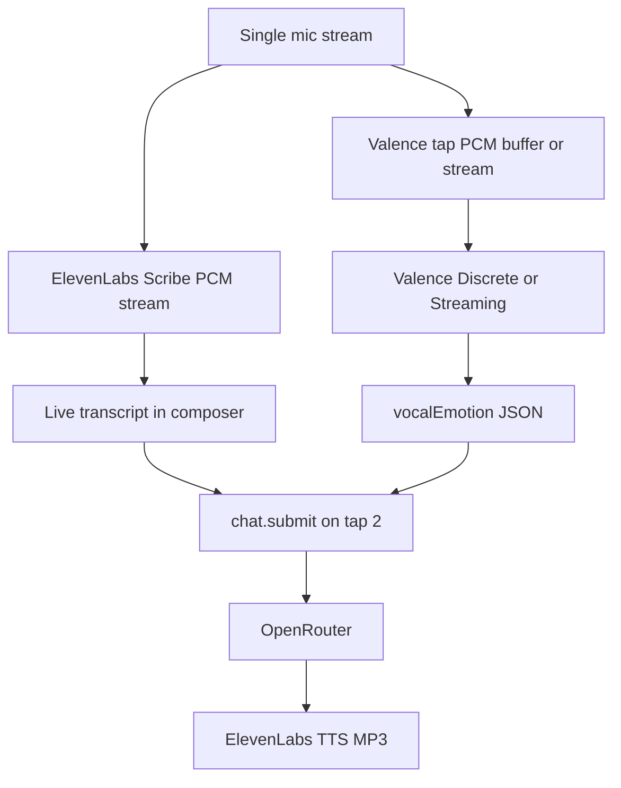
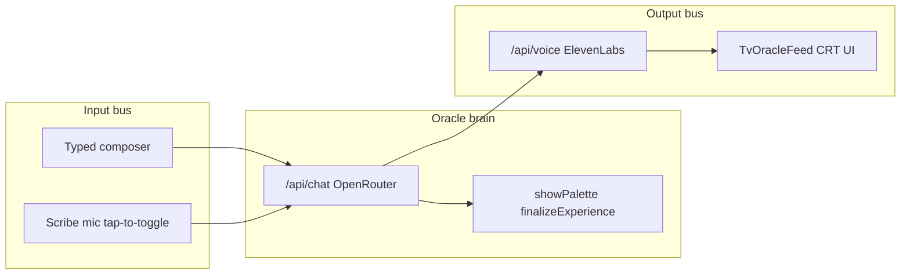
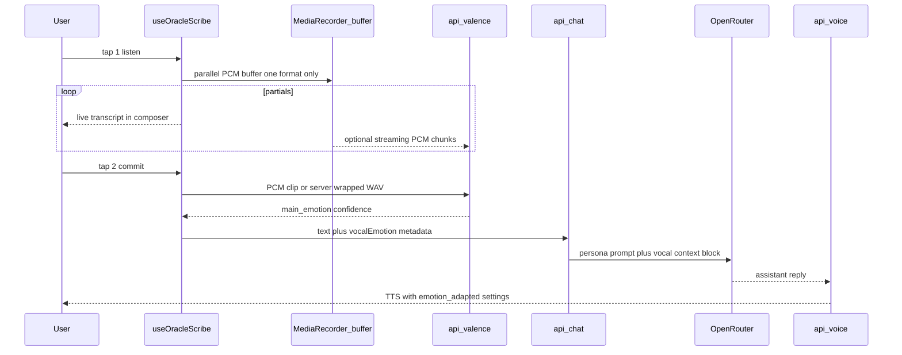
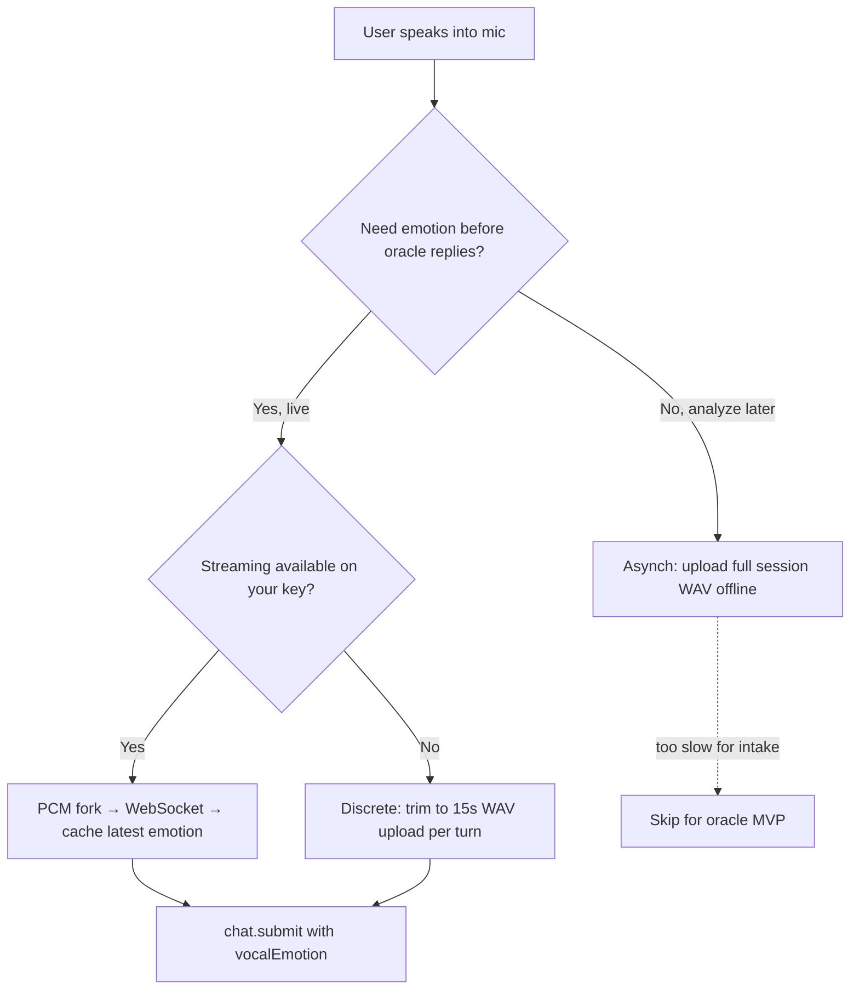
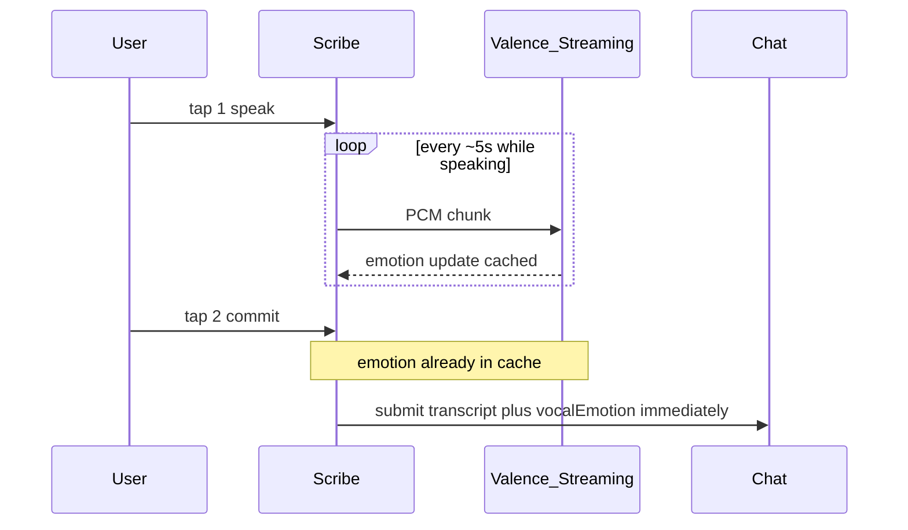

# Valence Emotion + Oracle Research Plan

> Living document. Saved June 2026.
> Related: [scribe-realtime-stt-plan.md](./scribe-realtime-stt-plan.md) · [remaining-features-plan.md](./remaining-features-plan.md) · [FOR_ETHAN.md](./FOR_ETHAN.md)

## Open questions

- ~~**Streaming WebSocket availability is unknown**~~ **Resolved (Spike A, 2026-06-06):** Streaming WebSocket is **live on our account** (`client.streaming.connect()` connects + predicts). No support ticket needed.
- **Streaming not yet wired into the app.** Phases 2–6 shipped the **Discrete** path (upload WAV, trim ≤15 s, ~2.5 s commit cap). Streaming — the plan's preferred primary path — remains unbuilt; it would remove the commit-time latency and the 15 s clip cap. Decide whether to migrate post-MVP. See [API choice](#api-choice-streaming-preferred-if-verified-discrete-as-documented-fallback).

## Research checklist

- [x] Spike A: Discrete baseline + Streaming WebSocket probe + wall-clock latency (see [Spike log](#spike-log)) — **Streaming live; Discrete 4.5–15 s confirmed**
- [x] Spike B: single PCM tap alongside Scribe — no mic conflict — **manual PCM mode (path b): one tap → Scribe `sendAudio` + WAV buffer; no second `getUserMedia`**
- [x] Spike C: inject vocalEmotion into `/api/chat` — word/tone mismatch per persona — **hidden `[VOCAL_TONE]` block; Marion/William/Lucy prompt sections**
- [x] Spike D: ElevenLabs voice_settings matrix for adaptive TTS — **persona × emotion maps in `oracle-voice-settings.ts`**
- [x] Design CRT emotion modifiers (no raw labels) — **`lastVocalEmotion` → diegetic CSS, gated on `onAir`**

---

## Short answer

**Yes — but only for how the user sounds, not what they type.**

Valence Pulse analyzes **vocal tone** (paralinguistics): angry, happy, neutral, sad, plus optional buckets like irritated, nervous, excited. Your oracle already reads **words** and palette reactions via OpenRouter in `[src/app/api/chat/route.ts](src/app/api/chat/route.ts)` and `[src/lib/oracle-personas.ts](src/lib/oracle-personas.ts)`. Valence closes the gap when someone says *"I'm fine"* but sounds **irritated** — a signal the LLM cannot reliably infer from text alone.

Think of it like ADR vs. performance: Scribe gives you the **script** (transcript); Valence gives you the **actor's delivery** (tone). The oracle currently only sees the script.

---

## What Valence actually provides


| Aspect             | Detail                                                                                                                                                                               |
| ------------------ | ------------------------------------------------------------------------------------------------------------------------------------------------------------------------------------ |
| Input              | Mono `.wav` upload payload, ideally 44.1 kHz; Discrete wants **4.5–15 s** per request (**5–10 s recommended**; intro docs round to "4–10 s")                                         |
| Output             | `main_emotion`, `confidence`, `all_predictions` per emotion                                                                                                                          |
| Default emotions   | angry, happy, neutral, sad                                                                                                                                                           |
| Extended (custom)  | surprised, disgusted, nervous, irritated, excited, sleepy                                                                                                                            |
| Latency (Discrete) | ~100–500 ms                                                                                                                                                                          |
| Language           | Optimized for **North American English conversational** speech                                                                                                                       |
| Privacy (Discrete) | Data-in-transit, **not stored** on Valence systems                                                                                                                                   |
| SDK                | `valenceai` on npm (Discrete + Asynch documented); Streaming WebSocket referenced in PyPI SDK but **not documented on site — probe in Spike A** |


**Discrete clip length (hard limits vs. guidance):**


|                 | Seconds   | Enforced?                                |
| --------------- | --------- | ---------------------------------------- |
| **Minimum**     | **4.5 s** | Yes — `AUDIO_TOO_SHORT` (400) if shorter |
| **Recommended** | 5–10 s    | No — best accuracy/latency sweet spot    |
| **Maximum**     | **15 s**  | Yes — `AUDIO_TOO_LONG` (400) if longer   |


The intro docs say "4–10 s" as a practical target; the `valenceai` SDK error table documents the actual floor (4.5 s) and ceiling (15 s). **10 s is not a hard cap.**

**Implication for oracle mic turns:** If a user holds the mic open and talks for 20+ seconds, trim to the **last 15 s** (most recent tone) or **first 15 s** before calling Discrete — do not upload the full blob raw. Utterances under 4.5 s → skip Valence for that turn (text-only), same as already planned.

**Confidence gate:** Valence docs *recommend* dropping predictions below **~0.38** client-side. **Not API-enforced** — verified 2026-06-06: API returns all predictions; 0.38 is an app-side threshold for weak signals.

**Pricing:** Enterprise agreement (you indicated you can get a key). Plan for per-utterance cost on top of existing ElevenLabs + OpenRouter spend.

Docs: [Introduction](https://docs.getvalenceai.com/introduction) · [Quickstart](https://docs.getvalenceai.com/quickstart) · [JS SDK](https://docs.getvalenceai.com/SDK/javascript)

---

## Audio formats: WAV requirement, MP3 confusion, and realtime feel

### Is WAV a hard requirement for Valence?

**For upload-based APIs (Discrete + Asynch): yes — the request payload must be WAV.** Valence docs specify mono `.wav` (ideal 44.1 kHz; minimum 8 kHz). MP3, WebM, and Opus are not accepted as upload payloads. This does **not** mean you must save user recordings to disk or keep them for later — it means the bytes you send in the HTTP request must be WAV-encoded (typically an in-memory blob or a temp file discarded immediately after the API call). The Python SDK also accepts an in-memory **float audio array** via JSON (server-side preprocessing), which is PCM under the hood — not MP3.

**For Streaming API: no upload file at all.** Chunks are raw **PCM bytes** over WebSocket (~5s analysis windows). Nothing is saved locally unless you choose to.

### Does ElevenLabs support non-MP3 output?

**Yes — but only on the TTS output path**, which is unrelated to Valence input.

Your `[src/app/api/voice/route.ts](src/app/api/voice/route.ts)` currently requests `Accept: audio/mpeg` (MP3). ElevenLabs TTS also supports PCM (`pcm_16000`, `pcm_44100`, etc.), Opus, μ-law, and other formats via the `output_format` query param. Browsers play MP3 natively with minimal latency, so MP3 remains the right default for oracle **speech playback**.

**Valence never sees ElevenLabs TTS output.** TTS is downstream of the LLM reply. Valence analyzes **user mic input** only.

### You do NOT need to record WAV and MP3 at the same time

There are three separate audio paths — only one needs extra work:


| Path                         | What happens today                                   | Format                                   | Valence involved? |
| ---------------------------- | ---------------------------------------------------- | ---------------------------------------- | ----------------- |
| **User → Scribe (STT)**      | Mic → PCM chunks over WebSocket → partial transcript | PCM internally; no saved file            | No                |
| **User → Valence (emotion)** | *Not built yet*                                      | WAV (Discrete) or PCM chunks (Streaming) | Yes               |
| **Oracle → TTS (playback)**  | Text → `/api/voice` → MP3 blob → `<audio>`           | MP3 (by choice)                          | No                |


Scribe already gives you realtime partials **without** writing any file. Valence adds a **second consumer** of the same mic performance — not a second file format.




### What actually runs in parallel (and what doesn't block realtime)

**During tap 1 → tap 2 (user is speaking):**

- Scribe partials must stay instant — this is the "realtime feel" you care about.
- Valence work here should be **zero blocking** on the partial path.
- If using **Streaming API**: PCM chunks go to Valence in parallel with Scribe; CRT can react live. No WAV encoding on client.
- If using **Discrete API**: buffer PCM silently in an `AudioWorklet` or `MediaRecorder` (WebM/Opus is fine — **one** recorder). Partials are unaffected.

**On tap 2 (commit):**

- Scribe `commit()` → transcript (already fast).
- Valence analysis runs **after** the user stops talking — acceptable ~100–500 ms before `chat.submit`.
- **Do not** await Valence before tearing down the Scribe session; run: commit → parallel `{ valence analyze, finalize buffer }` → submit when both resolve.
- Oracle streaming/TTS only starts after submit — user is no longer speaking, so this latency is post-utterance, not mid-speech.

**Recommended capture strategy (ranked):**

1. **Best realtime:** Valence **Streaming WebSocket** + Scribe manual `sendAudio` from one `getUserMedia` stream — single PCM format, forked to both services. Spike whether JS/WebSocket is available on your account.
2. **Simplest MVP:** `MediaRecorder` → WebM blob on commit → **server converts to WAV** (ffmpeg or lightweight wasm) before Discrete API. Client never encodes WAV; conversion happens off the hot path while user waits for oracle reply.
3. **Avoid:** Two recorders (WAV + MP3), or encoding WAV in the browser on commit — unnecessary CPU and complexity.

### ElevenLabs Scribe note

Scribe's mic mode calls `getUserMedia` internally. Sharing one stream cleanly may require switching to **manual audio mode** (`audioFormat: PCM_16000` + `sendAudio`) so you control the single tap that feeds both Scribe and Valence. Spike B validates this — it's an integration detail, not a format problem.

---

## How this maps to your current oracle stack

Your intake is already a **three-track signal chain**:




Valence inserts a **parallel analysis bus** on mic turns only:




**Key constraint:** `[useOracleScribe](src/hooks/use-oracle-scribe.ts)` owns the mic via ElevenLabs Scribe. Scribe does **not** expose a finished audio file on commit — you need a **single parallel PCM tap** (manual `sendAudio` fork, `AudioWorklet`, or one `MediaRecorder`) on the same mic stream. WAV is produced **server-side** for Discrete API, or skipped entirely if Streaming API accepts PCM chunks. This is the main engineering unknown to spike first — not dual-format recording.

> **⚠️ Code findings (verify before relying on the "shared stream" plan above)** — from reading `[use-oracle-scribe.ts](src/hooks/use-oracle-scribe.ts)`:
>
> 1. **The SDK owns `getUserMedia` internally.** `useScribe` (`@elevenlabs/react`) is configured with a `microphone: { echoCancellation, noiseSuppression, autoGainControl }` option and **does not currently expose the underlying `MediaStream`.** The "fork one shared stream to both Scribe and Valence" assumption is **unconfirmed** for this SDK. Spike B must first check whether `@elevenlabs/react` exposes the stream or a manual PCM `sendAudio` mode; if neither, fall back to a **second `getUserMedia`** dedicated to Valence (browsers allow multiple consumers of one mic device).
> 2. **Commit is synchronous today.** `onCommittedTranscript` → `onSubmit(trimmed)` → `finishSession()` fire in one tick. Attaching `vocalEmotion` requires *holding* submit until emotion resolves (or a ~1.5 s timeout), so a slow/failed Valence call never blocks send — a real rework of the hook's control flow, not just a new field.
> 3. **A lower minimum already exists.** Scribe rejects commits with **< 0.3 s** of audio (handled as a cancel via the `/uncommitted audio/i` guard) and cancels when no partial has arrived. Valence's own clip floor is higher — respect **both**: skip Valence (text-only) under Valence's floor even when Scribe accepted the commit.

**Typed turns:** No Valence signal. Oracle continues using text + palette reactions only — no regression.

---

## Three layers of "dynamic reaction" (your chosen scope)

### 1. Prompt / LLM layer (highest ROI)

Inject a **hidden context block** alongside each voice user turn (never shown in the TV feed):

```text
VOCAL_TONE (from mic analysis, confidence 0.71): irritated
Interpret delivery separately from word choice. If tone and words conflict, name the gap in character.
```

Extend each persona in `[src/lib/oracle-personas.ts](src/lib/oracle-personas.ts)` with a short **"VOCAL TONE"** section — same catalog/tools rules, different *interpretation*:


| Persona                 | Example dynamic behavior                                                        |
| ----------------------- | ------------------------------------------------------------------------------- |
| Marion (`ladybird_mom`) | Calls out performative "fine"; softens when vocal = sad                         |
| William (`witch`)       | Maps tone to "spiritual weather"; irritated → trial of patience                 |
| Lucy (`materialist`)    | Frames mismatch as compatibility signal; excited → lean into bold palette picks |


Also nudge **tool behavior**: `showPalette` film selection when vocal emotion contradicts stated mood (e.g., user says "light" but sounds **sad** → pick a film whose palette tests that gap).

**Wire point:** Extend `[src/lib/oracle-chat-transport.ts](src/lib/oracle-chat-transport.ts)` + chat route body to pass `vocalEmotion?: { emotion, confidence, predictions }`. Prepend to the user message server-side (cleaner than trusting client-only injection).

### 2. Diegetic UI layer (CRT broadcast)

Reuse the existing "on air" language from `[oracle-tv-scene.tsx](src/components/intake/oracle-tv-scene.tsx)` (`onAir = isSpeaking || streaming`):


| Detected tone            | CRT behavior (subtle, in-world)           |
| ------------------------ | ----------------------------------------- |
| irritated / angry        | Brief static burst, scanline intensity up |
| sad                      | Phosphor dims, slower flicker             |
| happy / excited          | Slightly warmer tint, cleaner signal      |
| neutral / low confidence | No change                                 |


Store last vocal emotion in client state from the Valence response; apply CSS modifiers on `[TvOracleFeed](src/components/intake/tv-oracle-feed.tsx)`. **Do not** show raw emotion labels to the user — keep it felt, not dashboard-y.

Optional Phase 2: if Streaming API is available on your account, show **live** static shifts *while* the user is still talking (Discrete only updates after commit).

### 3. TTS delivery layer

Extend `[src/app/api/voice/route.ts](src/app/api/voice/route.ts)` to accept optional `voiceSettings` (ElevenLabs `stability`, `similarity_boost`, etc.) derived from **user's** vocal emotion + **persona** baseline:


| User vocal | TTS adaptation (example)                                                    |
| ---------- | --------------------------------------------------------------------------- |
| sad        | Lower stability, slightly slower delivery — Marion/Lucy sound gentler       |
| irritated  | William stays firm but not escalated; Marion doesn't match snark with snark |
| excited    | Slightly higher energy; Lucy leans crisp                                    |


`[useOracleVoice](src/hooks/use-oracle-voice.ts)` would pass the last `vocalEmotion` when fetching TTS for the **reply** to that turn. This is **output** empathy, separate from Valence **input** analysis.

---

---

## Choosing an API — plain English (why the docs feel confusing)

The [Choosing an API](https://docs.getvalenceai.com/introduction#choosing-an-api) section only compares **two** products in its table. A third (**Streaming**) is mentioned in one sentence as "Coming soon" but has **no row, no doc page, and no OpenAPI entry**. The `[llms.txt` index](https://docs.getvalenceai.com/llms.txt) lists only Discrete + Asynch. The [OpenAPI spec](https://docs.getvalenceai.com/api-reference/openapi.json) exposes a single REST path: `POST /emotionprediction` (Discrete only).

**So the docs are incomplete, not you.** Below is what they actually document, plus what the npm/PyPI SDK adds unofficially.

### Film-set analogy

Think of Valence as three different ways to read an actor's delivery:


| API                                              | Analogy                                                      | What you send                                    | What you get back                                                           | When you'd use it                                              |
| ------------------------------------------------ | ------------------------------------------------------------ | ------------------------------------------------ | --------------------------------------------------------------------------- | -------------------------------------------------------------- |
| **Discrete**                                     | **One Polaroid** — snap a single frame of the performance    | One short WAV clip (~one sentence)               | **One** emotion + confidence for the whole clip                             | "How did that line land?" — right after the user stops talking |
| **Asynch**                                       | **Dailies review** — scan the whole reel later               | One long WAV (call, interview, entire recording) | **Timeline** — one emotion every ~5 s with timestamps (`00:00`, `00:05`, …) | Post-hoc analysis of a finished recording, not live chat       |
| **Streaming** *(undocumented on site; SDK only)* | **Live waveform monitor** — emotion meter while they perform | PCM chunks over WebSocket during speech          | Emotion updates as audio flows in                                           | Live agents, live CRT feedback, zero wait at commit            |


All three use the **same emotion model** underneath — they differ in **how audio is delivered** and **what shape the answer takes**.

### Discrete API (documented — the "real-time" one in the table)

**Despite the name confusion:** Discrete is "real-time" in the sense of **fast single-shot analysis**, not live streaming.

```
User stops talking → upload 4.5–15 s WAV → ~100–500 ms → { main_emotion, confidence }
```

- **Input:** One short mono WAV per request (intro says 4–10 s; SDK enforces 4.5 s min / 15 s max).
- **Output:** Single JSON — one dominant emotion for that entire clip.
- **How to call:** Raw HTTPS (`POST /emotionprediction`) **or** SDK. This is the only API with a public REST spec.
- **Oracle fit:** One emotion per mic turn. Simple. Adds post-commit latency (upload + transcode). **Cannot** natively handle a 30 s monologue without trimming to 15 s.

### Asynch API (documented — the "long file" one)

**Despite sounding like "async/await":** Asynch means **batch processing of long recordings**, not "fire-and-forget Discrete."

```
Upload entire WAV → wait (seconds to minutes) → poll → timeline of emotions every ~5 s
```

- **Input:** Long WAV (≥5 s, up to 1 GB).
- **Output:** Array of `{ t, emotion, confidence }` — see [intro example](https://docs.getvalenceai.com/introduction#outputs).
- **How to call:** **SDK only** — `upload()` then `emotions(requestId)`. No REST shortcut in OpenAPI.
- **Storage:** File briefly kept on Valence servers during processing (cleared within 24 h).
- **Oracle fit:** **Poor for live intake.** You'd upload after each turn and wait for polling — far too slow for "oracle responds now." Better for analyzing saved session recordings offline.

### Streaming API — availability unknown; try before asking Valence

Intro says **"Coming soon – StreamingAPI via WebSockets."** The `valenceai` PyPI package documents `client.streaming.connect()` with PCM chunks, but **official site docs do not explain it** — no table row, no doc page, no OpenAPI entry.

**We do not know if Streaming is enabled on our API key until we probe it ourselves.** Contacting Valence support is a fallback, not step one.

#### Spike-first protocol (before any support email)

1. **Discrete baseline** — confirm the key works at all (`POST /emotionprediction` or `client.discrete.emotions()` with a 6 s WAV).
2. **Streaming probe** — attempt connection with the same key:
   - `valenceai` npm/Python `client.streaming.connect()` if exposed in the installed package
   - Raw WebSocket to `wss://api.getvalenceai.com` (or `VALENCE_WEBSOCKET_URL` from SDK env docs) with `x-api-key` / auth pattern from PyPI README
   - Send a short PCM buffer; log connect success, first prediction, close codes, error payloads
3. **Record outcome** in [Spike log](#spike-log):
   - **Pass** → Streaming is primary path; no support ticket needed
   - **401/403** → key lacks Streaming entitlement; fall back to Discrete or email Valence
   - **404 / connection refused / unknown endpoint** → Streaming not live on this environment; Discrete only
   - **Undocumented errors** → capture full payload, then optionally email Valence with evidence

**If Streaming works:** Best oracle fit — long utterances, emotion cached before commit, live CRT.

**If Streaming fails:** Discrete fallback (trim ≤15 s, budget 0.5–1.5 s post-commit latency) or skip Valence for demo.

### Decision tree for the oracle




**For your app:** Discrete is what the docs steer you toward for conversational "real-time." Streaming is what you actually want for long turns + low commit latency — but you have to validate outside the introduction page.

---

## API choice: Streaming preferred if verified, Discrete as documented fallback

Your skepticism on latency is warranted. **100–500 ms is Valence's claimed API processing time only** — not what the user feels from tap 2 → oracle starts thinking.

### Honest latency budget (tap 2 → `chat.submit`)


| Stage                          | Discrete path (typical)                   | Streaming path (typical)                                        |
| ------------------------------ | ----------------------------------------- | --------------------------------------------------------------- |
| Scribe `commit()` + transcript | ~50–200 ms                                | ~50–200 ms                                                      |
| Finalize audio buffer          | ~50–100 ms                                | negligible (already streaming)                                  |
| Upload audio to our server     | **~100–400 ms** (WAV blob, mobile varies) | none at commit                                                  |
| Server WebM → WAV transcode    | **~100–500 ms** if needed                 | none                                                            |
| Valence API processing         | 100–500 ms (their docs)                   | **~0 ms at commit** — last chunk already received during speech |
| **Total added before LLM**     | **~400 ms – 1.5+ s** realistic            | **~0 ms** if latest emotion cached from stream                  |


The intro docs' "100–500 ms" assumes a small WAV is already in hand. In a browser app, **upload + transcode often dominate** — so treating Discrete as "~200 ms" would be misleading.

**Spike A must measure wall-clock** from mock commit → emotion JSON in hand, on your network, with a realistic 6–15 s clip — not just Valence's internal number.

### Long utterances (>10 s, >15 s)


| API           | Long speech behavior                                                                                                                                    |
| ------------- | ------------------------------------------------------------------------------------------------------------------------------------------------------- |
| **Streaming** | **No clip cap.** Analyzes in ~5 s windows for the whole mic session; at commit, use the **most recent** window's emotion. Fits rambling oracle answers. |
| **Discrete**  | Hard **15 s max** per upload; must trim. Loses early tone if you keep only the last 15 s. Not ideal for long monologues.                                |


Since you're okay with long mic turns as long as streaming handles them, **Streaming should be the primary path** if your account exposes it (verify in Spike A/B first). Discrete becomes fallback for short turns or if Streaming isn't available in JS.




### Revised API ranking


| API                       | Role                     | Notes                                                                                        |
| ------------------------- | ------------------------ | -------------------------------------------------------------------------------------------- |
| **Streaming (WebSocket)** | **Primary** if available | Handles long utterances; emotion ready at commit; enables live CRT during speech             |
| **Discrete**              | **Fallback**             | Per-utterance upload; trim to ≤15 s; budget **0.5–1.5 s** added latency; skip if clip <4.5 s |
| **Asynch**                | Skip                     | Long-file batch pipeline; wrong shape for interactive intake                                 |


---

## Recommended research spikes (before feature work)

### Spike A — Valence smoke test + Streaming probe (~1–2 hrs)

**Try first; ask Valence only if the probe is inconclusive.**

- Add `VALENCE_API_KEY` to local env (never commit)
- `bun add valenceai` (server-only for Discrete fallback)
- **Step 1 — Discrete baseline:** 6 s WAV → confirm key works; log latency + response shape
- **Step 2 — Streaming probe:** attempt WebSocket connect + PCM chunk(s); log connect / first prediction / errors (see [Streaming availability](#streaming-api--availability-unknown-try-before-asking-valence))
- **Step 3 — Wall-clock compare:**
  - Streaming: 20 s mock utterance → time to first emotion chunk; is latest emotion cached at commit?
  - Discrete: 6 s and 15 s WAV → full upload/transcode pipeline → emotion JSON
- Log `AUDIO_TOO_SHORT` / `AUDIO_TOO_LONG` failure modes
- Write results to [Spike log](#spike-log) below

### Spike B — Browser single-tap capture (~2 hrs)

- Option A: Scribe manual mode + `sendAudio` fork to Valence Streaming WebSocket (if available)
- Option B: one `MediaRecorder` (WebM) or `AudioWorklet` (PCM) on shared `getUserMedia` stream
- On commit: verify partials were never delayed; server-side WAV wrap for Discrete if needed
- Confirm no conflict with Scribe echo cancellation / turn-taking guards in `[useOracleVoice](src/hooks/use-oracle-voice.ts)`

### Spike C — LLM sensitivity test (~1 hr)

- Manually inject vocal context into `/api/chat` requests (curl or dev harness)
- Test word/tone mismatch scenarios per persona
- Tune prompt wording so characters react without breaking tool workflow (`showPalette`, `finalizeExperience`)

### Spike D — TTS mapping test (~30 min)

- Call ElevenLabs with varied `voice_settings` for same Marion line
- Pick 2–3 emotion→settings maps that feel in-character, not uncanny

---

## Architecture decisions to lock after spikes

1. **Client vs server Valence call:** Always **server-side** (`/api/valence` or merged into chat route) — never expose `VALENCE_API_KEY` to browser.
2. **Merge vs separate route:** Prefer `**POST /api/valence`** returning JSON, called from `useOracleScribe` on commit **before** `chat.submit` — keeps chat route focused and lets you skip Valence on short clips without blocking send.
3. **Show emotion to user?** Recommend **no** — oracle performs the insight in dialogue; CRT sells it subliminally.
4. **Streaming API:** **Primary path** if account supports it — solves long utterances and commit-time latency. Discrete only if Streaming unavailable.

---

## Risks and mitigations


| Risk                           | Mitigation                                                                                                                                           |
| ------------------------------ | ---------------------------------------------------------------------------------------------------------------------------------------------------- |
| TV speaker bleed into mic      | Existing `echoCancellation` + `cancelSpeech()` on mic start; accept some false positives in demo                                                     |
| Short utterances under 4.5s    | Duration check → skip Valence, text-only turn                                                                                                        |
| Long utterances over 15s       | **Streaming primary** — no cap; Discrete fallback trims to last 15 s only                                                                            |
| Low confidence                 | Threshold at 0.38; persona ignores weak signal                                                                                                       |
| Extra latency before send      | Streaming: ~0 ms at commit (emotion cached during speech). Discrete: budget **0.5–1.5 s** real-world; spike to confirm. Never block Scribe partials. |
| Latency skepticism             | Spike A measures full tap-2→submit path; if Discrete too slow, Streaming is the fix — not "accept 200 ms"                                            |
| Dual-format recording overhead | Single PCM tap only; WebM→WAV conversion server-side; TTS stays MP3 on separate path                                                                 |
| Non-English / accent drift     | Document as known limitation; NA English optimized                                                                                                   |
| Cost                           | ~~1 Valence call per mic turn (~~4–6 per intake session)                                                                                             |


---

## What NOT to do

- Do **not** replace LLM mood reading with Valence — text and palette reactions remain primary for film curation.
- Do **not** send Valence audio from typed-only sessions.
- Do **not** change the tool pipeline (`showPalette`, `finalizeExperience`) — Valence is **input + presentation**, same philosophy as TTS in `[docs/remaining-features-plan.md](docs/remaining-features-plan.md)`.

---

## Suggested implementation order (post-research)

1. Spike A + B — **Streaming availability + wall-clock latency** (gates everything else)
2. If Streaming works: PCM fork → WebSocket proxy (if JS unavailable) + cached emotion at commit
3. If Streaming blocked: Discrete fallback with trim + accept longer post-commit delay (or skip Valence on latency-sensitive demo)
4. Chat route vocal context + persona prompt additions
5. CRT emotion modifiers (live if Streaming; post-commit if Discrete)
6. TTS adaptive `voice_settings`
7. Update `[docs/FOR_ETHAN.md](docs/FOR_ETHAN.md)` with the new "emotion bus" beat

**Estimated effort after spikes pass:** ~1–2 days if Streaming works; +0.5–1 day if Discrete-only fallback needs transcode pipeline tuning.

---

## Spike log

> Verified by `scripts/valence-spike.ts` on **2026-06-06** against `api.getvalenceai.com` / `wss://api.getvalenceai.com`.

| Probe | Date | Result | Notes |
| ----- | ---- | ------ | ----- |
| Discrete baseline (6 s WAV) | 2026-06-06 | **PASS** | Key works. 1336 ms wall-clock. Response: `{ main_emotion, confidence, all_predictions, model_type, processing_time_ms, request_id }`. Synthetic sine → `sad` @ 0.405. |
| Streaming WebSocket connect | 2026-06-06 | **pass** | `wss://api.getvalenceai.com` via Socket.IO (`client.streaming.connect()`). Session established; no 401/403/404. |
| Streaming first prediction | 2026-06-06 | **PASS** | First prediction ~2.9 s after connect (includes 5 s of PCM chunks sent). Window `00:00:00`–`00:00:04` (~4.5 s analysis window). Same shape as Discrete. |
| Discrete wall-clock (6 s clip → JSON) | 2026-06-06 | **1336 ms** | Upload + API processing (API reported 138 ms internal). |
| Streaming wall-clock (commit → cached emotion) | 2026-06-06 | **~0 ms at commit** (design) | Emotion arrives during speech; last prediction cached before mic stop. Spike sent 5 s PCM then waited 3 s — 1 prediction received. |
| Limit probe: 3 s clip | 2026-06-06 | **AUDIO_TOO_SHORT (400)** | `min_duration_seconds: 4.5`, `actual_duration_seconds: 2.5` (API measured shorter than file header — treat **4.5 s** as floor). |
| Limit probe: 20 s clip | 2026-06-06 | **AUDIO_TOO_LONG (400)** | `max_duration_seconds: 15.0`, `actual_duration_seconds: 20.0`. |
| Confidence gate 0.38 | 2026-06-06 | **Not API-enforced** | SDK/docs recommend ~0.38 as a *client-side* drop threshold. API returns predictions regardless; synthetic clip returned 0.405. Keep 0.38 as app constant with "recommended, not verified API limit" comment. |
| Support email sent? | 2026-06-06 | **no** | Streaming probe succeeded — no ticket needed. |