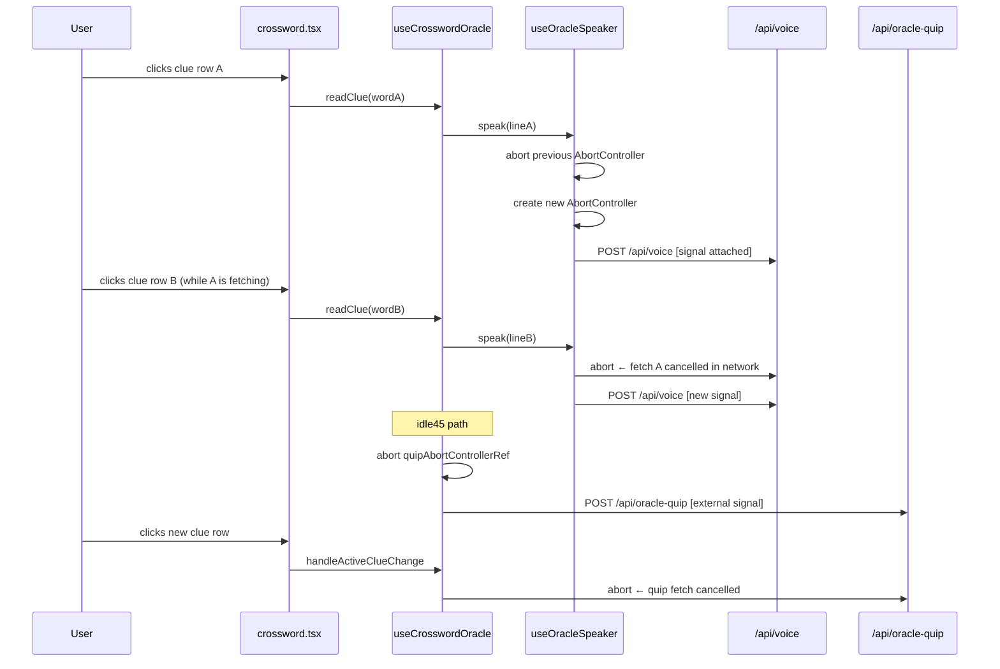

# Implementation Plan — Voice Preemption

**PRD:** [`prd.md`](./prd.md)

Three files, three surgically small changes. No new dependencies. No API or schema changes.

---

## Data Flow After This Change

---

## Step 1 — `src/hooks/use-oracle-speaker.ts`

**Goal:** Attach an `AbortController` to every `/api/voice` fetch so it is cancelled at the network level when preempted.

**Changes:**

1. Add `abortControllerRef = useRef<AbortController | null>(null)` alongside the existing refs.

2. In `speak()`, immediately after `++speakGenerationRef.current`:
    - Abort the previous controller: `abortControllerRef.current?.abort()`
    - Create and store a new one: `abortControllerRef.current = new AbortController()`
    - Pass `signal: abortControllerRef.current.signal` to the `fetch("/api/voice", ...)` call.

3. In `cancelSpeech()`, add `abortControllerRef.current?.abort()` before `stopPlayback()`.

**No changes needed to error handling.** The existing `catch` block already returns `false` silently for abort errors via two guards:

- `if (generation !== speakGenerationRef.current) return false` — catches the common case (preempted by a newer call)
- `if (/interrupted|abort/i.test(message)) return false` — catches any remaining `AbortError` message strings

---

## Step 2 — `src/lib/crossword-oracle-quip-fetch.ts`

**Goal:** Allow `fetchOracleQuipLine` to accept an external `AbortSignal` so the caller can cancel an in-flight `/api/oracle-quip` LLM fetch.

**Changes:**

1. Add an optional fourth parameter: `externalSignal?: AbortSignal`.

2. Build the final signal to pass to `fetch`:
    - If `externalSignal` is provided: `AbortSignal.any([externalSignal, controller.signal])`
    - If not: use `controller.signal` as today (no behaviour change for existing callers)

3. Keep `clearTimeout(timeout)` where it is — it still needs to run after a successful response to prevent the timeout from firing unnecessarily, even when `externalSignal` is the one that may abort first.

4. The `catch { return null }` block already swallows `AbortError` silently — no change needed there.

> **Note on `AbortSignal.any`:** Available in Chrome 116+ (Aug 2023), Node 20+, and Bun 1.0+. This project targets modern browsers and runs on Bun, so no polyfill is needed.

---

## Step 3 — `src/hooks/use-crossword-oracle.ts`

**Goal:** Wire the external signal from Step 2 into the idle45 LLM fetch, and abort that fetch when the active clue changes.

**Changes:**

1. Add `quipAbortControllerRef = useRef<AbortController | null>(null)` alongside existing refs.

2. Update the module-level `fetchIdle45Quip` to accept a `signal?: AbortSignal` and forward it to `fetchOracleQuipLine` as the new fourth argument.

3. In `speakIdleTier`, inside the `tier === "idle45"` branch, before calling `fetchIdle45Quip`:
    - Abort any previous LLM fetch: `quipAbortControllerRef.current?.abort()`
    - Create and store a fresh controller: `quipAbortControllerRef.current = new AbortController()`
    - Pass `quipAbortControllerRef.current.signal` to `fetchIdle45Quip`

4. In `handleActiveClueChange`, after updating timing state, add:
   `quipAbortControllerRef.current?.abort()`
   This ensures that if an idle45 fetch is running for the previous clue when the user selects a new one, it is cancelled immediately — even though no audio is triggered by the clue change itself.

> **Dependency arrays:** `quipAbortControllerRef` is a ref and does not need to be added to any `useCallback` dependency array. `handleActiveClueChange` keeps its empty `[]` dep array.

---

## Build Order

Do these in sequence — each step is independently testable:

1. `use-oracle-speaker.ts` — test by opening DevTools Network, triggering two rapid clue clicks; first fetch should show `(cancelled)`.
2. `crossword-oracle-quip-fetch.ts` — unit test: pass an already-aborted signal; verify `null` is returned without throwing.
3. `use-crossword-oracle.ts` — test by sitting on a clue for 45s to trigger the LLM fetch, then clicking a new clue; the oracle-quip request should show `(cancelled)` in Network.

---

## What Does NOT Change

- `crossword-with-oracle.tsx` — no wiring changes needed; `readClue` and `handleActiveClueChange` signatures are unchanged
- The generation guard (`speakGenerationRef`) in `useOracleSpeaker` — stays as the authoritative last-call-wins gate
- Idle 20s/45s timer cadence and dwell logic
- Completion reactions (`onWordFilled`)
- The `debugIdle45` path — it calls `fetchIdle45Quip` without a signal; acceptable since it's a dev-only debug action
